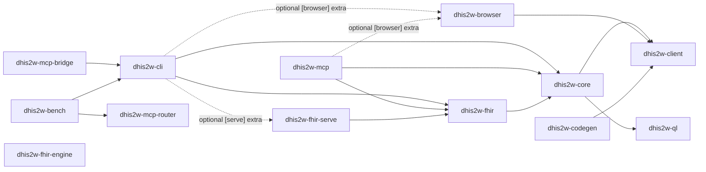

# CLAUDE.md

Guidance for Claude Code working in this repository.

## NO EMOJIS EVER

Not in commit messages, PR titles, PR descriptions, code comments, docstrings, documentation, design notes, or any output. Use plain text (`[x]`, `[ ]`, `CRITICAL`, `Note:`, `WARNING:`) instead.

## Hard requirements (non-negotiable)

These reshape every decision. Re-read them when in doubt.

1. **Multi-instance support via profiles.** Auto-discover a profile from the current working directory by walking up for `.dhis2/profiles.toml`; fall back to `~/.config/dhis2/profiles.toml`. When nothing is found, the CLI raises `NoProfileError` pointing the user at `d2w profile add <name>` / `d2w profile bootstrap`, and MCP tools return the same actionable error.
2. **DHIS2 v41 / v42 / v43 supported via per-version subpackages.** Each major has its own hand-written tree under `dhis2w_client.v{41,42,43}` + `dhis2w_core.v{41,42,43}.plugins.*`; the client auto-detects via `/api/system/info` on connect and binds the matching tree (v42 is the canonical baseline). No compatibility shims for DHIS2 versions older than v41.
3. **Auth is pluggable; ship three kinds of provider: Basic, PAT, OAuth2/OIDC.** `dhis2w-client` defines an `AuthProvider` Protocol. The client never touches auth internals. OAuth2 uses the OAuth 2.1 authorization-code flow with PKCE against `/oauth2/authorize` and `/oauth2/token`. Future providers (service-account JWT, OIDC federation, proxy-injected headers) land as new files in `dhis2w-client/auth/` without touching the client.
4. **Playwright UI automation is isolated in `dhis2w-browser`.** API-only installs must not pull Chromium. The screenshot plugin is the first consumer; future UI-update plugins layer on the same helpers.
5. **`uv` for everything Python, organized as a `uv` workspace.** Thirteen members under `packages/`: the eleven publishable ones — `dhis2w-client`, `dhis2w-core`, `dhis2w-cli`, `dhis2w-mcp`, `dhis2w-mcp-bridge`, `dhis2w-browser`, `dhis2w-ql`, `dhis2w-mcp-router` (first published in 1.2.0), `dhis2w-fhir`, `dhis2w-fhir-serve` (first published in 1.5.0), `dhis2w-fhir-engine` (first published in 1.7.0) — plus the workspace-only `dhis2w-codegen` and `dhis2w-bench` (not published). Single `uv.lock` at the workspace root, `uv_build` backend. Every member uses the `src/` layout. Shared code lives in a workspace member (never a floating `src/` outside a package). **Never edit `pyproject.toml` deps by hand — use `uv add` / `uv add --dev`.**
6. **FastAPI for any HTTP service, FastMCP for any MCP service.** No Flask, no bare `http.server`, no hand-rolled stdio loops.
7. **Pydantic for ALL structured data. No `dict`s. No `@dataclass`es.** Every type that carries domain meaning — DHIS2 resources, service return values, CLI output shapes, MCP tool returns, error bodies, configuration, view-models, command options — is a `pydantic.BaseModel`. DHIS2 resource models (Me, SystemInfo, DataElement, Indicator, …) live in `dhis2w-client/models/` so PyPI users of the client get them. Plugin-internal view-models (reports, job state, summaries) live in the plugin's `models.py`. `Dhis2Client` returns parsed models, not raw dicts.

    - `dict[str, Any]` is allowed only at the HTTP/JSON boundary (the raw response body inside `_parse_json` before it's validated) and for pass-through escape hatches like `get_raw` / `post_raw` whose callers immediately wrap the result in a model.
    - **"Immediately wrap" is enforced literally.** A `dict[str, Any]` that leaves the function it was parsed in — flowing through the plugin layer, service return types, CLI handlers, tests — is a rule violation, not a gray zone. If the dict is going to another module, it must be wrapped in a `BaseModel` first. The pattern "parse, then `_dump()` back to a dict so MCP can serialise it" is banned: return the typed model and dump at the MCP tool edge, not at the service layer.
    - When DHIS2's wire shape is genuinely dynamic (e.g. `GET /api/metadata` returns resource-collection keys that vary across versions), wrap it in a `BaseModel` with `model_config = ConfigDict(extra="allow")` and typed accessor methods — not a bare dict. A typed wrapper with an escape hatch is vastly preferred to an untyped dict shipped across module boundaries.
    - `@dataclass` is not allowed — even for "internal" types. If it needs named fields, it's a `BaseModel`. Use `model_config = ConfigDict(frozen=True)` when you'd have reached for `@dataclass(frozen=True)`.
    - Tuples-as-structs (`(name, code, description)`) are not allowed in new code — name the fields in a model.
    - CLI commands still accept Typer parameters, but anything the command produces (JSON output, table rows, return values consumed by another layer) is a model, not a `dict`.
    - **Code-review trigger**: when you find yourself writing `dict[str, Any]` in a function signature (parameter or return type), stop and ask whether a `BaseModel` would fit. The answer is "yes" in every case except the literal HTTP-boundary escape hatches above.
    - **Check the generated OAS schemas BEFORE hand-writing a model.** Any model that mirrors a DHIS2 wire shape almost certainly already exists in the generated trees. Before authoring a new `BaseModel`, grep `dhis2w_client.generated.v{41,42,43}.oas` (e.g. `grep -rn "class <Name>" packages/dhis2w-client/src/dhis2w_client/generated/`) and reuse the emitted class — import it the way `dhis2w_client/v42/system.py` imports `SystemInfo`. Hand-roll a plugin-internal view-model only when (a) no generated schema covers the shape (genuinely new reports / job state / summaries), or (b) the generated one can't represent the live wire response. When it's (b), log the mismatch in `BUGS.md` and cite that entry in the model's docstring so the duplication is justified, not accidental. Worked example: `SecuritySettings` is a deliberate projection of the generated `SystemSettings` because the full model can't validate `/api/systemSettings` (BUGS.md #42).
8. **pytest for ALL testing.** `pytest-asyncio` (auto), `respx` for HTTP mocking, `typer.testing.CliRunner` for CLI, in-process `httpx.AsyncClient` for FastMCP/FastAPI integration tests. No `unittest`.
9. **ruff + mypy + pyright for ALL Python code**, strict configs. Copied verbatim from `/Users/morteoh/dev/chap-sdk/chapkit/pyproject.toml`. All three must pass under `make lint`.
10. **If any persistent storage is needed, default to SQLAlchemy + SQLite over asyncio** — `sqlalchemy[asyncio]` with `aiosqlite`, typed `Mapped[...]` columns, Alembic for migrations. DB files live beside the active profile (`.dhis2/tokens.sqlite`, `.dhis2/cache.sqlite`). No Postgres, no ORM-free raw SQL, no pickled files.
11. **Typer for every CLI** — root CLI, plugin sub-apps, anything in `examples/`. No `argparse`, no `click` directly, no `sys.argv` parsing.
12. **CLI surface is heavily preferred.** New capabilities expose a CLI command first and an MCP tool second, both calling the same `service.py`. Plugins without a `cli.py` need explicit justification; plugins without an `mcp.py` are fine (e.g. `profile` is CLI-only).
13. **Makefile drives every workflow.** Core targets: `make install / lint / test / test-slow / coverage / docs / docs-serve / docs-build / build / clean / clean-artifacts`, plus target families for the local DHIS2 stack (`dhis2-*`), codegen (`dhis2-codegen-*`), model benchmarking (`bench-*`), and PyPI releases (`publish-<member>` / `publish-all`) — `make help` lists them all. CI calls make targets, not raw commands.
14. **Docs use mkdocs-material.** `mkdocs.yml` mirrors chapkit's. Docs live in `docs/`; build output in `site/` (gitignored). API reference uses `mkdocstrings` to auto-generate from pydantic models and service docstrings.
15. **Per-version subpackages — every behaviour-changing edit considers v41 / v42 / v43.** Hand-written code in `dhis2w-client` lives under `dhis2w_client.v{41,42,43}.*`; the plugin tree in `dhis2w-core` lives under `dhis2w_core.v{41,42,43}.plugins.*`. The generated trees at `dhis2w_client.generated.v{41,42,43}.*` are already split. **When you add, rename, or remove a public symbol, an example, or a CLI command, you must apply the same edit to all three trees** — sed-sweep, then re-read the diff to confirm. A new file lands in three locations; a fix lands in three locations; a deletion lands in three locations. Tests cover all three. **Examples do not**: they live version-neutral at `examples/{cli,client,mcp}/` in one copy that runs against all three majors, with `examples/fhir/{cli,client}/` beside them for the version-agnostic FHIR packages, and a variant under `examples/{surface}/v{N}/` only where one major genuinely has an example the others cannot run. A client example needing a version-pinned import is written against v42 and says to swap the module for another major. Every example is small, about one feature, and verified by `make verify-examples`. When v41 and v43 diverge from v42 because the wire shape genuinely differs, fold that divergence into the same PR with a BUGS.md entry — don't ship "fixed in v42 only, v43 follow-up later".

## Architecture

Five orthogonal axes of extension — extending one never forces edits to another:

- **Workspace members** (`packages/`): each shippable unit. New surfaces (a future FastAPI web UI, another SDK) land as new members.
- **Version subpackages** (`dhis2w_client.v{41,42,43}/`, `dhis2w_core.v{41,42,43}/plugins/`): each DHIS2 major has its own hand-written tree. The three trees start as mechanical copies of v42 (the canonical baseline) and diverge per-file as version-specific behaviour lands.
- **Plugins** (`dhis2w-core/v{N}/plugins/<name>/`): each DHIS2 domain is a folder with `__init__.py` and `cli.py` always; `service.py` when the plugin has logic (grouping shells like `data` and `dev` only mount sub-apps); `models.py` when the plugin has view-models (small models may live inline in `service.py`); `mcp.py` optional with justification. Tests live outside the shipped package, grouped per domain at `packages/dhis2w-core/tests/<name>/` (one test tree parametrised over the three version trees — never per-tree test copies). Discovered automatically by iterating `dhis2w_core.v{N}.plugins.*` (today: v42); external plugins register via `importlib.metadata.entry_points(group="dhis2.plugins")`.
- **Auth providers** (`dhis2w-client/v{N}/auth/`): `AuthProvider` Protocol. Ship Basic, PAT, OAuth2. Add more without touching `client.py`.
- **FHIR version trees** (`dhis2w_fhir_engine.r4/`, later `r5/`): the evaluation engine's own version axis, parallel to the DHIS2 v41/v42/v43 split. The grammar, parser, AST, and evaluator are FHIR-version-neutral; everything bound to a release lives in a version subpackage and reaches the neutral core as a `FhirVersionBinding` value. A new FHIR release is a new subpackage exporting a `FhirVersionBinding` (and, where the wire shapes differ, its own data sources and measure report writer) — never an edit to the evaluator.

Dependency arrows (no cycles):



## Documentation standards

- Every Python file: one-line module docstring at top.
- Every class: one-line docstring.
- Every method/function: one-line docstring.
- Format: triple quotes `"""docstring"""`. Google style. Keep it one line when possible.

## Keep docs/project/features.md in sync with code

`docs/project/features.md` is the user-facing feature catalog. When a PR adds, removes, or renames a plugin, CLI command, MCP tool, auth provider, client API, or any other user-visible capability, update `docs/project/features.md` in the same PR. A stale feature list is worse than no feature list.

## Keep docs and examples in sync with code

Every behaviour-changing PR must leave `docs/`, `examples/`, and `docs/project/features.md` matching the new reality. Not later — **in the same PR**.

- Rename a kwarg, add a flag, change a return type, rename a directory? Grep for the old name across `docs/`, `examples/`, `README.md`, top-level architecture pages, and every `*.md` in `docs/guides/`. Update each hit or record an explicit reason not to.
- Add a new plugin command or MCP tool? Add an example under `examples/cli/` and `examples/mcp/` (plus `examples/client/` if the new surface has a library path) — one file per surface, not one per version tree. A `d2w fhir` addition lands under `examples/fhir/` instead. Each new example is small, shows one feature, and passes `make verify-examples`; if it genuinely cannot be executed in a batch pass, it goes in that script's `SKIP_BY_DEFAULT` with the reason stated beside it.
- Add a new make target or script? Mention it in the target's help line + in whichever page under `docs/` documents the nearest neighbour.
- Remove a feature or rename a package? Sweep the same places — stale references that point at removed code are worse than no docs.
- Run `make docs-build` after doc edits so broken links surface.
- Adding a new public symbol to `dhis2w-client` (new model, helper, module, exception)? Three things need to move in the same PR:
  1. A Google-style docstring on every class / method / public function (one-liner is enough per the docstring standard above).
  2. A top-level re-export in `packages/dhis2w-client/src/dhis2w_client/__init__.py` + entry in `__all__`.
  3. An `::: dhis2w_client.<module>` reference in the matching `docs/api/<module>.md` page (or a new page under `docs/api/` linked from `docs/api/index.md` and the mkdocs nav). The `mkdocstrings[python]` plugin auto-renders the module; the docstring quality is what shows up on the site.
  4. The step-by-step guide at `docs/client/tutorial.md` should show the new symbol in a worked example if it's user-facing.

If a change legitimately doesn't need a doc or example update, say so in the PR description so the reviewer doesn't have to reconstruct that reasoning.

## Upstream DHIS2 quirks — log to `BUGS.md`

When you hit a DHIS2 behaviour that looks like a genuine bug or design surprise (inconsistent HTTP content-negotiation on sibling endpoints, workarounds the API forces on callers that feel wrong, silent fall-backs to non-obvious defaults, etc.), append an entry to the top-level `BUGS.md`. Each entry needs:

- DHIS2 version observed on.
- Minimal `curl` (or equivalent) repro that a DHIS2 maintainer can paste.
- Expected vs actual behaviour.
- Any workaround applied in this repo (with a file path) so the workaround is discoverable when the upstream fix lands.

The goal is to make it easy for the user to raise these upstream later without having to re-investigate. Don't pre-filter — if something surprised you enough to spend time on it, it's worth recording even if it turns out to be WAI on closer reading.

## Greenfield language — don't narrate history this repo doesn't have

This repo is pre-1.0 and has no deployed users. Nothing is being "fixed" or "migrated" or "deprecated" — every change is just the first working version of the thing. Write commit messages, PR descriptions, code comments, and docs in that voice:

- **Avoid**: "Fixed X", "Corrected Y", "Updated Z to match...", "Migration from old API", "Deprecated foo, use bar", "Backward-compatible path", "For legacy callers".
- **Prefer**: "Use X", "Do Y", "Add Z", "Remove foo". State what the code does now, not what it used to do.
- Rename the old name out of existence in the same PR — no aliases, no shim, no deprecation warning. A single commit renames the field, every caller, every doc page, every example.
- If you rewrite a file because the previous shape was wrong, the commit message says what the new shape is and why — not "fixed the broken old shape".
- In docstrings and comments: describe current behaviour. Never "was changed from ...", "previously ...", "note: changed in v0.2".

The audience for commit messages + docs is someone reading this repo cold. They don't care about the history of how we got here. Write as if the current state is the only state that ever existed.

## Leave the working tree clean

The repository holds source, not the output of running it. Reports, screenshots,
scratch projects, browser state, and property-test caches belong in `reports/`,
in the session scratchpad, or nowhere — never scattered across the repository
root, and never in a directory a command happened to be invoked from.

- `make clean-artifacts` sweeps them; `make clean` runs it as its first step.
- Run a command that writes a report from a scratch directory, or point it at
  one. A `d2w security` run left fifteen timestamped directories in the root
  once; that is the failure this rule exists to prevent.
- A `.gitignore` entry is not a licence to leave a file behind. Ignored still
  means present, and a root full of ignored output is a root nobody can read.
- There is no `CHANGELOG.md`. The git history and the GitHub releases are the
  record; `gh release create --generate-notes` writes release notes from merged
  pull requests. Do not reintroduce one.

## Git workflow

Branch + PR is the default. Ask before creating branches or PRs.

- Branch naming: `feat/*`, `fix/*`, `refactor/*`, `docs/*`, `test/*`, `chore/*`
- Commit prefixes: `feat:`, `fix:`, `chore:`, `docs:`, `test:`, `refactor:`
- NEVER include "Co-Authored-By: Claude" or any AI attribution.
- NEVER use emojis in commits, PR titles, or PR descriptions.
- Always run `make lint && make test` before opening a PR.

## UI copy rules (owner-set, violations are review-blockers)

Every user-facing string - nav labels, headings, hints, captions, legends, empty
states, tooltips - follows these rules. They exist because each was violated once.

- **No shorthand nouns.** "Organisation units", never "org units"; never bare
  "unit(s)" for an organisation unit. The full term is not that much bigger.
- **No theatrical headings.** "Hierarchy", not "The hierarchy"; "Map", not
  "On the map". A panel heading names its content plainly or is omitted when the
  content's own title serves (a detail panel headed by the thing's name needs no
  generic label).
- **Say the fact, not the verb.** "Not yet sent to DHIS2", not "awaiting forward" -
  a reader must not need to know a command name to understand a status.
- **Never state one fact twice in two casings.** A "Level 1" badge beside a
  "level-1" chip is one fact wearing two costumes; pick the human spelling once,
  keep the machine spelling for machine contexts (codes, ids - mono).
- **Name the actual subject.** "This DHIS2 instance stores no boundary", not
  "DHIS2 holds no geometry" - the platform, an instance, the API, and the
  organisation are different things, and "DHIS2" unqualified can mean a hundred of
  them. Say which one. No trailing philosophical clauses.
- **Copy review is a review dimension.** Any change adding or moving user-facing
  text gets read as prose - by someone whose only job in that pass is the words.

## Naming

Full descriptive names, no abbreviations. `repository` not `repo`. `profile_store` not `ps`. Applies to classes, attributes, locals, parameters.

## Code quality

- Python 3.13+, line length 120, type annotations required everywhere.
- Double quotes. `async/await` throughout the runtime. Conventional commits.
- Class order: public → protected → private.
- `__all__` only in `__init__.py` files when exporting a package surface.
- Always run `make lint` and `make test` after changes.

## Dependency management

```
uv add <package>             # runtime dep, in the right member
uv add --dev <package>       # dev dep (workspace root)
uv add --package <member> <package>   # add to a specific workspace member
uv lock --upgrade            # refresh the workspace lock
```

**Never edit `pyproject.toml` deps by hand.**
