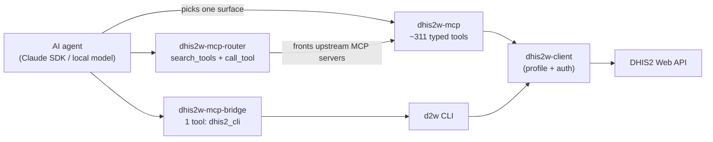
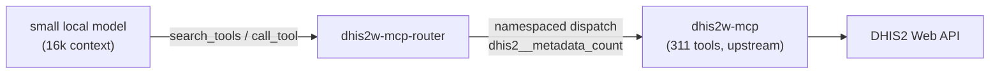

# MCP surfaces: full server, bridge, router

There are three ways an AI agent reaches DHIS2 through MCP. They share the same `dhis2w-client` and the
same profiles/auth underneath — they differ **only in how the DHIS2 tool surface is presented to the
model**. Picking the right one is mostly about one constraint: the model's context budget versus the
size of the tool surface.

This page is the map. Each surface has its own deep-dive (linked below); here is how they relate, how a
call flows end to end, and how to choose.

## The one problem they each solve differently

DHIS2 is large: the full typed server exposes **~311 tools**, whose JSON schemas cost **≈49k tokens** if
streamed into context up front. A capable cloud model can hold that; a small on-box model cannot — and
even cloud models pay for it on every turn. So each surface makes a different trade between **how much
the model sees up front**, **how hard it is to discover the right tool**, and **how cheaply it can be
guarded**.

| | full server (`dhis2w-mcp`) | bridge (`dhis2w-mcp-bridge`) | router (`dhis2w-mcp-router`) |
| --- | --- | --- | --- |
| Exposes | ~311 typed tools | **1** tool (`dhis2_cli`) | **2** meta-tools (`search_tools` + `call_tool`) |
| Up-front payload | huge (~49k tokens) | tiny | tiny |
| Discovery | none (all schemas present) | high — learn a CLI via `--help` | low — keyword/semantic search |
| Typed schemas | yes | no (CLI strings) | yes (search returns schemas) |
| Guardable chokepoint | per-tool | one tool | one dispatch (`call_tool`) |
| Read-only switch | `DHIS2_MCP_READONLY` | `DHIS2_MCP_READONLY` + host-guard | `MCP_ROUTER_READONLY` / per-upstream |
| Best for | capable **cloud** models | small **on-box** models, PII/local | small models **and** multi-server federation |

The router is the middle ground: the bridge's tiny payload and single guard chokepoint, but with
**typed** discovery (search returns real schemas) instead of forcing the model to learn a CLI.

## How a call flows

All three end at the same place — the DHIS2 Web API, via `dhis2w-client` and the active profile.

- **Full server**: `agent → dhis2w-mcp → dhis2w-client → DHIS2`. The model calls a typed tool directly.
- **Bridge**: `agent → dhis2_cli → d2w CLI → dhis2w-client → DHIS2`. The model passes a CLI command
  string; the bridge runs `d2w` in a subprocess.
- **Router**: `agent → router → (upstream MCP server, e.g. dhis2w-mcp) → … → DHIS2`. The model searches,
  then dispatches; the router proxies to whichever upstream owns the tool.

## Composition: `mcp ⇒ router ⇒ DHIS2`

The router is not a fourth competing server — it **fronts** other MCP servers. The canonical setup
points it at the full `dhis2w-mcp` server, so a small model drives the full typed surface through two
tools:

Because the router is **domain-neutral**, the same instance can front *several* upstreams at once —
`dhis2` + a tracker server + a non-DHIS2 server — and present them as one searchable surface with
`server__tool` namespacing. That is the portable, MCP-native equivalent of the Claude Agent SDK's
ToolSearch, but it works with **any** MCP client (LM Studio, Ollama, llama.cpp), not just Claude.

## Security model (shared)

Security is **defense in depth**, identical in spirit across all three surfaces. See each surface's page
for specifics; the layers are:

1. **Authoritative — DHIS2 credential authorities.** The hard guarantee. A read-scoped PAT/user means
   nothing the agent does can write, server-enforced. Everything below is a convenience guard that
   catches mistakes *before* they reach DHIS2 and shrinks the blast radius of prompt injection.
2. **Structural read-only modes.** `DHIS2_MCP_READONLY` (bridge + full server) and
   `MCP_ROUTER_READONLY` / per-upstream `readonly` (router) hide write tools and refuse them at the
   chokepoint — fail-closed (a tool whose verb isn't a known read is treated as a write). The
   single-tool bridge and the router's `call_tool` are *single* chokepoints, which is why they are the
   easiest to guard.
3. **Host protection.** The bridge additionally refuses writes to shared public hosts
   (`DHIS2_MCP_PROTECTED_HOSTS`) regardless of read-only mode, so an agent can't mutate a shared demo.
4. **Data residency.** PII/tracker → **local model + bridge/router** (data never leaves the box);
   aggregate/non-PII → cloud is acceptable. Locality is the only control for PII.
5. **No arbitrary execution.** None of these expose a general shell/`bash` tool — injected DHIS2 data
   can at worst call a *DHIS2* tool the agent already had, never arbitrary code.

The threat that actually matters for agents is **prompt injection via data** (a malicious value in DHIS2
metadata that tells the model to do something destructive). Read-only-by-default + scoped credentials +
no execution tools bound the damage.

### Destructive commands are CLI-only by design

The full server's tool surface is deliberately narrower than the CLI's command surface: the most
destructive operations exist as `d2w` commands but are **not** exposed as MCP tools. A human at a
terminal types these knowingly; an agent should not be able to reach them at all, whatever the
read-only mode says. The omissions are:

- tracker deletes — `d2w data tracker delete`, `d2w data tracker enrollment delete`,
  `d2w data tracker event delete` (cascading `importStrategy=DELETE` bundles)
- metadata visualization and map deletes
- legend-set clone
- dashboard remove-item

An agent that genuinely needs one of these goes through the bridge, where the operation is still a
CLI command string subject to the bridge's read-only and protected-host guards — or through a human
running the command directly.

## Choosing a surface

- **Capable cloud model (Claude, GPT, Gemini), aggregate data** → **full server**. It holds the 49k
  payload and grounds on typed params. Cheapest discovery (none).
- **Small on-box model, PII/local** → **bridge** or **router**. Both fit a tiny context. The bridge is
  the simplest and most battle-tested; the router adds typed discovery (less trial-and-error) and
  federation, at the cost of being newer.
- **Many MCP servers to unify, or you want one searchable surface** → **router** — it's the only one
  that federates.
- **You need the strongest, simplest single guard** → bridge or router (one chokepoint each).

## Evidence

The trade-offs above are measured, not asserted — see the [benchmark results](../notes/benchmark-results.md):
capable local models drive the full server at 128k; cloud Claude is cheaper over the full typed surface
than over the bridge (the bridge's CLI discovery costs turns); and a small local model
(`gemma-4-26b-a4b-qat`) drove the full **311-tool** surface through the **router at 16k context**,
read-only — the router's reason to exist, proven.

## Deep dives

- Full server — [setup](../mcp/index.md), [tutorial](../mcp/tutorial.md), [architecture](mcp.md), [tool reference](../mcp-reference.md).
- Bridge — [usage](../mcp/bridge.md), [design](mcp-bridge.md).
- Router — [design](mcp-router.md).
