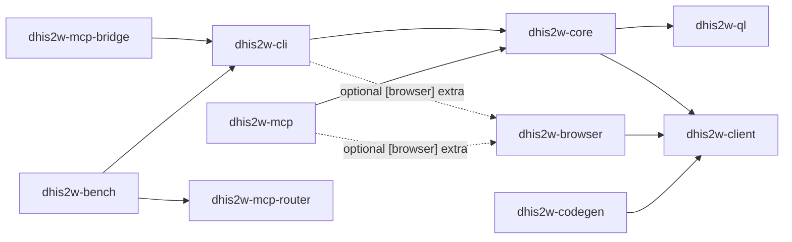

# Architecture overview

> **Learning path · step 7 of 8** — Design notes, limitations, future work. Prev: [API reference](../api/index.md). Next: [BUGS.md](https://github.com/winterop-com/dhis2w-utils/blob/main/BUGS.md). Use this when you want to know *why* the codebase is shaped the way it is; the surface-tab Architecture pages cover individual plugins.

`dhis2w-utils` is designed around **three orthogonal axes of extensibility**. Extending one should never force edits to another — that's how we keep this codebase maintainable as it grows.

## The three axes

### 1. Workspace members (shipping units)

Each shippable unit of code is a `uv` workspace member under `packages/`:

| Member | Role | PyPI |
| --- | --- | --- |
| `dhis2w-client` | Async DHIS2 API client + `Profile` model + `open_client(profile)` for PAT/Basic/session auth. | [`dhis2w-client`](https://pypi.org/project/dhis2w-client/) |
| `dhis2w-core` | TOML profile resolution, OAuth2 token store, plugin registry, first-party plugins. | [`dhis2w-core`](https://pypi.org/project/dhis2w-core/) |
| `dhis2w-ql` | d2ql query + transform engine (FHIRPath-compatible expression core). | [`dhis2w-ql`](https://pypi.org/project/dhis2w-ql/) |
| `dhis2w-cli` | Thin Typer console-script shell. | [`dhis2w-cli`](https://pypi.org/project/dhis2w-cli/) |
| `dhis2w-mcp` | Thin FastMCP server shell. | [`dhis2w-mcp`](https://pypi.org/project/dhis2w-mcp/) |
| `dhis2w-mcp-bridge` | Single-tool MCP bridge exposing the `d2w` CLI to small local models. | [`dhis2w-mcp-bridge`](https://pypi.org/project/dhis2w-mcp-bridge/) |
| `dhis2w-browser` | Playwright helpers for UI automation. | [`dhis2w-browser`](https://pypi.org/project/dhis2w-browser/) |
| `dhis2w-codegen` | Version-aware client generator. | _workspace-only_ |
| `dhis2w-bench` | Local-LLM benchmark harness (coding, mcp-bridge, full-mcp suites). | _workspace-only_ |
| `dhis2w-mcp-router` | Domain-neutral MCP router: search + dispatch meta-tools over upstream MCP servers. | [`dhis2w-mcp-router`](https://pypi.org/project/dhis2w-mcp-router/) |

New surfaces (a future FastAPI web UI, an HTTP webhook receiver, a TUI) land as new members. No edits required to existing ones.

### 2. Plugins inside `dhis2w-core`

Each DHIS2 domain (metadata, tracker, analytics, screenshots, indicator validation, …) is a self-contained plugin package in `dhis2w-core/src/dhis2w_core/v42/plugins/<name>/`. Every plugin is a folder with this shape:

```
<name>/
├── __init__.py        # exports `plugin = Plugin(name="<name>", ...)`
├── models.py          # plugin-internal pydantic view-models (reports, summaries, job state)
├── service.py         # async pure functions — single source of truth for the domain
├── cli.py             # Typer sub-app wrapping service.py
├── mcp.py             # FastMCP tool registrations wrapping service.py
└── tests/
```

The CLI and MCP surfaces both call into the same `service.py`. They never drift out of parity because neither is primary.

Plugins are discovered two ways:

- **Built-ins** — iterate `dhis2w_core.v42.plugins.*` at startup.
- **External** — `importlib.metadata.entry_points(group="dhis2.plugins")`. An external package (like `dhis2w-codegen`) can add commands/tools without a PR.

### 3. Auth providers inside `dhis2w-client`

`dhis2w-client` defines an `AuthProvider` Protocol. The client never touches auth internals — it just asks for headers. Three providers ship with the package: `BasicAuth`, `PatAuth`, `OAuth2Auth`. Future providers (service-account JWT, OIDC federation, proxy-injected headers) land as new files in `dhis2w-client/auth/` without touching `client.py`.

## Dependency arrows



No cycles. `dhis2w-client` is the foundation everything builds on, which is what lets it ship to PyPI independently.

## Per-version subpackages

`dhis2w-client` and `dhis2w-core` are organised into per-major subpackages so each DHIS2 version (v41, v42, v43) can evolve its own hand-written code without entangling the others:

```
dhis2w_client/{v41,v42,v43}/        # hand-written client surface per major
dhis2w_client/generated/{v41,v42,v43}/   # auto-generated wire types per major
dhis2w_core/{v41,v42,v43}/plugins/  # plugin tree per major
```

The three trees start as mechanical copies of v42 (today's canonical baseline) and diverge per-file as version-specific quirks land (CategoryCombo COC regeneration on v43, the `categorys` -> `categories` rename, v41's missing `OAuth2ClientCredentialsAuthScheme`, etc.). For files that don't yet diverge, all three trees still import from `dhis2w_client.generated.v42.*` to keep the symbol set consistent.

**When you add, rename, or remove anything,** apply the change to all three trees. New plugin commands ship as three plugin files; new examples ship as three example files (`examples/v41/`, `examples/v42/`, `examples/v43/`); bug fixes that aren't version-specific land in all three. The CLAUDE.md hard requirements section spells this out at "Per-version subpackages" — the codebase enforces three-tree symmetry by convention, not by tooling, so the diff is the only check.

## Why this matters

Every time a new requirement comes in, we should be able to say "that's a plugin", "that's a new auth provider", or "that's a new workspace member" — and build it in isolation. If a new requirement forces edits across three members, the architecture is wrong.
