# Capture in the browser

The served endpoint answers machines. This turns the same endpoint into
something a person can use: open a data set and it renders as a form with its
sections, its disaggregated grids, and its option lists; open a tracker
programme and it asks for the person, the enrolment dates, and the
attributes DHIS2 collects at registration. Fill it in, submit it, and the
submission comes back as a receipt you can read question by question. It is
how you check that what came out of your instance is still the form your
staff would recognise - not a replacement for the DHIS2 Capture app.

**Who this is for:** the operator exercising a served project by hand -
opening forms, filling them, and reading receipts - without writing a line
of curl.

**Before you start:** a project you can serve
([Serve the guide](201-serve.md)). An installed wheel ships the UI already;
a checkout needs `make build-frontend` once.

**You will be able to:**

- serve the capture UI and know what it does and does not add to the facade
- fill a form with generated test data, change what you like, and submit it
- register a person with no program, and answer a registration for somebody
  the DHIS2 instance already holds
- search the DHIS2 instance for a person, page through the people it holds, and
  read what it holds about one of them
- read a receipt back joined to the questions it answers
- follow a receipt's lifecycle from the browser while `d2w fhir forward`
  runs in a terminal
- reach any page, form, or receipt from the command palette on Cmd+K, see every
  key the app answers with `?`, and pick which of the seven themes the screens are
  painted in

## Serve it

`d2w fhir serve --ui` serves a browser UI alongside the FHIR routes,
same-origin with them, at the same address:

```bash
d2w fhir serve --ui          # what `make serve` and `make serve-live` run in a scaffolded project
```

Open the address it prints. The UI reads the very endpoint it is served
from, so there is no URL to configure and nothing to point at anything.

**The UI shadows nothing.** Its bundle is mounted in two pieces around the
FHIR routes, so `/metadata`, `/Questionnaire`, and every other served path
answer exactly as they do without `--ui`, and a resource type the facade
does not serve is still an OperationOutcome rather than a page. Routing
inside the UI is hash-based (`#/responses`), so a reload on any page works
with no server-side rewrite. And the UI is authenticated exactly as the
facade is - which under the default `auth = "none"` means not at all, and
everything [What this server is not](201-serve.md#what-this-server-is-not)
says applies to it unchanged.

**Signing in, where a posture is configured.** A facade started with
`--auth dhis2`, `--auth token`, or `--auth jwt` asks who this is before it
draws a page, and the prompt is the one that posture calls for: a DHIS2
username and password, a field for one of the deployment's tokens, or a
field for a token headed with the issuer it has to come from. The posture is
read off `/metadata`, which is the one address open in every scope.

**What is typed is checked before it is kept.** Submitting asks the server
`GET /whoami` with those credentials, and nothing is stored until the server
names the caller. A wrong password is refused at the prompt - *DHIS2 did not
accept this username and password.* - with the fields still there to try
again with, and a server that could not be reached says so instead, because
credentials that were never checked are not credentials that were rejected.
Without that check the default `write` scope leaves every read open, so the
first thing that would refuse a wrong password is a submission somebody
spent minutes filling in. The name the header then shows is the one the
**server** answered with - the DHIS2 instance's own spelling of the
username, or under `jwt` the claim the server read out of the token - never
what was typed into the box. The token posture names nobody, because a
deployment token is not a person. **Sign out** in the header forgets the
credential and the name, and the prompt comes back.

A credential can still go stale after somebody signs in - a password
changed, an account disabled - and that is met at the next request. The
refusal arrives on the page, the prompt comes back with the same sentence,
and the credential is dropped rather than signed with again. This is why the
DHIS2 posture's 401 names `xBasic` in its `WWW-Authenticate` header rather
than `Basic`: a browser meeting `Basic` on a request a page made opens its
own credential dialog and never hands the response back, so Submit would sit
pending forever instead of saying what happened. Callers still **send**
`Authorization: Basic <base64>`; only the challenge's scheme name differs,
and it differs for every caller alike rather than by guessing which ones are
browsers.

The credential is held in `sessionStorage`, for that browser tab only:
closing the tab ends the session, and a second tab signs in on its own.

In a checkout, `--ui` before the bundle exists refuses in one line rather
than serving a blank page:

```
error: `--ui` needs a built frontend at .../dhis2w_fhir_serve/static, and there is
none. Build it with `make build-frontend` (an installed wheel ships it already).
```

## The Overview

The root route answers one question: what is the state of capture right now.

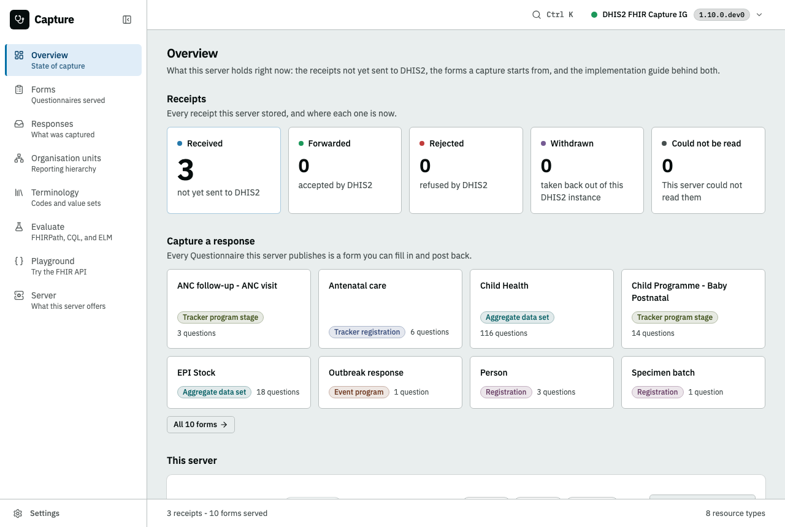

**Receipts** is the spool's counts off `GET /spool` - `Received`,
`Forwarded`, `Rejected`, `Withdrawn`, and, when the spool holds files it could
not read, `Quarantined` - with `Received` set large because it is the one that
is a task: it is the queue [`d2w fhir forward`](201-forward.md) drains. Each count is a link into the
Responses table already narrowed to that state
(`#/responses?lifecycle=received` is a link you can send someone), and the
rejected count names the DHIS2 error code most of its receipts share -
"Rejected 12" and "Rejected 12, mostly E1029" lead to different afternoons.
The count is per receipt rather than per issue, because one submission
carrying forty rows of the same broken rule is still one stuck submission.

**Capture a response** puts the served forms underneath as quick-entry cards
- title, DHIS2 kind, question count - each opening the form itself. **This
server** closes the page with one strip: the guide being served and its
version, the store mode, how many resource types it answers for, and the
operations it declares as `$translate` / `$generate` badges. A project with
nothing captured yet gets an invitation to open a form rather than a row of
zeroes, and each section fails on its own - a spool that stops answering
does not blank the forms beside it.

## Forms, and the form itself

**Forms** lists every `Questionnaire` this server publishes, grouped by the
DHIS2 capture model it came from (read off the `D2FormType` extension - a
form carrying none sits in its own stated section, because the facade will
refuse to capture against it). **Data sets** are periodic reports for an
organisation unit, with no person involved; **Event programs** record single
events without registering anyone; **Tracker programs** get one card
per program - its registration form first, its stages nested beneath -
because stages record visits for a person the registration enrols; and
**Tracked entity registration** registers a tracked entity in this DHIS2
instance without enrolling it in a program. Every form is a card carrying
its kind as a tinted badge, its question count and its id, and the whole card
opens the form.

A registration-only form is generated from a DHIS2 tracked entity type rather
than from a data set or a program, so it belongs to neither of the other
shelves: it names no program to group under and no period to report for. It is
the same registration surface with the enrollment taken out - a subject, an
organisation unit, and the attributes the type itself collects - and its
receipt files no enrollment at all. DHIS2 hangs an organisation-unit
assignment on a data set and on a program and never on a type, so a
registration-only form is reportable at every published organisation unit and
gets a **Tracked entity registration** shelf of its own in the
organisation-units rail too.

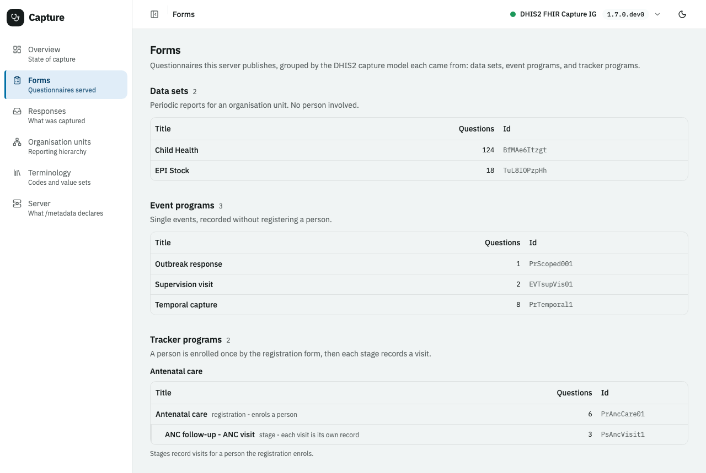

Open one and you get the form itself - every question as the control its R4
item type asks for: a switch for a yes/no, a bounded number field for a
percentage, the browser's own date and time pickers, a dropdown for an
option-set question whose choices come from expanding the ValueSet it binds,
and a searchable organisation-unit picker for a DHIS2 `ORGANISATION_UNIT`
data element. A question that takes several answers gets add and remove
rows. Every question is labelled with its DHIS2 uid as well as its text,
because that uid is what the server's refusals, the spool, and DHIS2 itself
all name it by.

### The shape a form is drawn in

A control is as wide as what goes in it. A weekly case count is a box a dozen
characters across, with a numeric keypad and the digits set right; a name, a
code or an address gets about sixty characters, which is the line a reader
takes in at a glance; a date is the width of a date. The one control that
keeps the full width is the narrative box a DHIS2 `LONG_TEXT` data element
asks for, because the answer is paragraphs and a paragraph is what a wide box
helps.

Questions whose answers are that shape then share the line: a run of them
flows into as many columns as the screen has room for, so the same form reads
as one column on a laptop split in two and as three or four on a wide screen.
A narrative, a section, and a question that takes several answers each keep a
line of their own.

**A run of data elements cut the same way is one block, and how wide the cut is
decides its shape.** An aggregate data set nests a question per category option
combo under a group per data element, so fourteen elements cut by four age bands
is fifty-six questions - and stacked, each with its own label, its own uid and
its own row, that is a screen nobody reads to the bottom of.

*Up to four combos, the run is a table.* The elements share one ordered set of
combos, which is what a header row states once: the data elements are the rows,
the combos are the columns, and the answer is the cell where they meet. It is
the shape DHIS2's own data entry uses. Each cell is a box a count fits in rather
than a borderless slot, the rows are striped, and the table sits in a bordered
box of its own.

*Every row closes with what it currently adds up to.* A **Total** column, muted
beside the boxes it sums, recomputed as they are typed in - the arithmetic a
clerk was going to do on paper anyway, and how a 1370 typed where 137 was meant
is caught at the desk rather than in a DHIS2 validation rule a fortnight later.
None of it is submitted: a data set's own totals are DHIS2's to compute. A row
nobody has typed in has no total, because a zero there would be a claim of zero
made on behalf of whoever had not filled it in; a blank beside a figure counts
as nothing rather than as zero; and a box holding something that is not a number
leaves no figure at all, rather than a total that quietly disagrees with what is
on screen. A run whose cells are not one element cut several ways - a section of
plain numeric data elements reaches this shape too - is drawn without any total,
because adding live births to bed nets is not a figure.

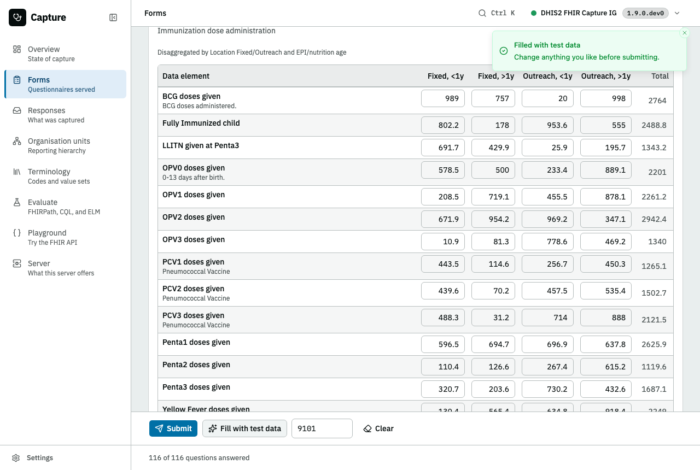

*A cut over two categories is banded first.* Such a combo writes both categories
into its name - `Female, under 15y` - and one table over all of them is wider
than any screen. The category with fewer options becomes a band - a
headed box per value, the value on the band - and the other stays the columns:
Female's four ages, then Male's. At most six options become bands, and only
where every band ends up with the same options of every remaining category; a cut over two large categories has no band form at all. The band is
part of the table shape rather than an alternative to it, so eight combos that
band into two fours are still a table - twice.

**None of that reads the combo's name.** A DHIS2 admin can reorder the categories
inside a category combo - gender then age one day, age then gender the next - and
when they do, every combo in it is renamed and DHIS2 expands the cells in a
different order. A screen that read `Female, under 15y` would band by gender one
day and by age the next: the same data set drawn two entirely different ways. So
the band is chosen from the *set* of categories the served combo vocabulary
publishes for each combo - which category, which option, by uid - counting
options and breaking a tie on the category's name. The bands and their rows are
then put back in each category's own option order, which is the one ordering a
reorder leaves alone, so `under 15y` still precedes `over 49y`. Two spellings of
one cut are the same screen. A combo whose vocabulary has not been read yet, or
which decomposes over a single category, simply has no band form.

*Wider than four, the run is rows.* Each element gets a box of its own, its name
on the band across the top, and one line per combo under it: the combo on the
left, its box on the right. Nothing scrolls sideways at any width, which is the
whole reason this shape exists. Past about ten lines they wrap into two column
groups and past two dozen into three, so the band stays in view while the last
box is reached. Under a facet band the lines carry only the category the band did
not name, because a line reading `Female, Afghanistan` under a band reading
*Female* states the gender twice. What the element currently adds up to reads on
the right of its band - *Total 226* - over every line it has, filtered or not.

*From thirty lines, the band gains two ways of getting to one of them.* A box
that narrows the lines by name as you type - *Filter 96 Facility*, where the cut
names a single category - and an *Unfilled only* tick that leaves the lines still
waiting for a value. Both sit on the band they narrow, so the way to a line is
never a screen above it, and every band of the run answers to what is typed into
any of them. Both hide lines from the screen and do nothing else: a line that is
hidden keeps its answer, and emptying the box brings every line back with its
value in it.

**One switch on each run overrides the ladder.** It sits on the run's own strip,
beside what the run is cut by - one per run, never one per band - and says what
pressing it does: *Show as rows* on a table, *Show as columns* on a list of rows.
The choice is remembered per run in this browser, so a form reopened is drawn the
way it was left, and a run nobody has an opinion about follows the ladder. A cut
no arrangement makes a table of - more than a dozen columns however it is banded -
offers no switch, because there is nothing to switch to.

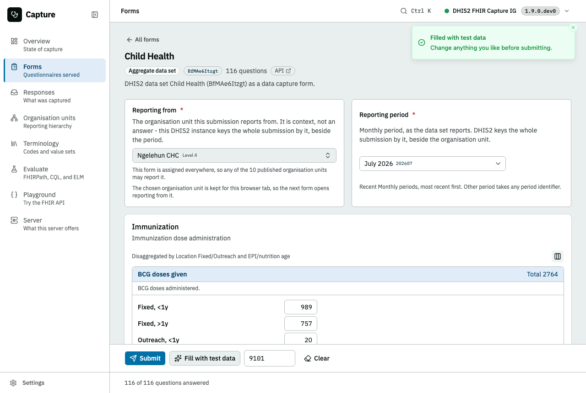

**No uids inside a run.** Every cell of a table belongs to a data element and a
category option combo that both have one, and a chip on each would put fifty-six
identifiers on a screen whose whole purpose is fifty-six numbers. The uids stay
where somebody looking for one goes: the form's own heading, the API view, and
the raw response.

What every cell of the run accepts is stated once for the run, beside the
categories it is cut by: *0 or more* under a table is one fact, not one fact per
cell. Where the elements of a run differ, each cell states its own.

An element cut differently opens its own run, and an element whose cells are
coded, dated or narrative answers stays stacked - a table cell is a box a number
fits in. Whichever shape a run is drawn in, the keyboard walks it in document
order and every cell keeps its own linkId: a capture filled in as rows is the
same QuestionnaireResponse the table produced, and so is one filled in under a
filter.

DHIS2 holds more about a form than R4 has elements for, and a generated form
carries the rest as extensions the screen reads:

- **A data element's description** is help text somebody wrote for whoever
  fills the form in - "Count a dose once, on the day it was given" - and it
  reads under the question's label. A section's reads under its heading.
- **A table of disaggregated cells names the categories it is cut by**:
  *Disaggregated by Location Fixed/Outreach and EPI/nutrition age*, above it. A
  column is headed with its category option combo's own name - `Fixed, <1y` -
  which names one corner of a grid and never says which grid, so the axes are
  stated once. They are joined from the served combo vocabulary's own property
  declarations, in the order DHIS2 declares the category combo: nothing here
  sorts a decomposition, or a combo expansion. This line is the one place a
  reordered category combo still shows - it names the same categories the other
  way round - while the shape the run is drawn in does not move.
- **A stage form says whether it repeats** - *Repeats: each visit is its own
  record* - where the form describes itself, and on its row in the forms
  listing. A form declaring nothing states nothing.
- **A question DHIS2 answers is not one you are asked.** A generated tracked
  entity attribute arrives `readOnly`, and the published dictionary says it is
  generated and to what shape - so the control is disabled and says *DHIS2
  fills this in when the submission is imported, shaped `ANC-#######`*. It is
  not counted among the required questions the form is waiting on, and
  `$generate` draws no value for it: the instance mints one on import, and a
  drawn value shaped like a real identifier would be a claim about a person
  this server has no grounds to make. The capture validator holds the same rule
  from the other side and admits the absence even where the form marks the
  question required. The shape is DHIS2's own text pattern, verbatim - the
  Child Programme's *Unique ID* reads *DHIS2 fills this in when the
  submission is imported, shaped `RANDOM(#######)`* - so what the screen shows
  is the rule the instance will apply, not an example of its output.

### What the form will not accept, and what DHIS2 will not accept after it

A value is graded in three places, and the form publishes enough for the first
two of them to happen before anything leaves the browser.

- **The range a question admits** rides on the standard R4 `minValue` /
  `maxValue` extensions: a date field's calendar greys out the days outside
  them, and the question's hint states the range in words (*between 0 and 100*,
  *2026-01-01 or later*). Type a value outside it and Submit refuses, naming the
  fact and nothing else - *137 is above 100, the highest value this form
  accepts*. A numeric question is a plain text box with a numeric keypad rather
  than an `<input type="number">`, so what was typed is what is held: the
  browser drops the characters it cannot parse, and Submit states what it
  cannot carry (*5.5 is not a whole number, which is what this question
  records*) instead of leaving the answer out of the submission in silence. Nobody is told what to type instead: the form states what it accepts,
  and what to do about that is the reader's call. `$generate` draws inside the
  bounds too, so a drafted answer is never one the form would refuse.
- **The conditions a question is asked under** ride on R4 `enableWhen`, with
  `enableBehavior` combining several. The evaluation is plain R4: `=`, `!=`,
  `>`, `<`, `>=`, `<=` and `exists`, holding when *any* answer to the named
  question satisfies them, and a condition on a question nobody has answered
  never holds - there is nothing to compare - except `exists=false`, which is
  exactly the operator that reads absence as a fact. A group's conditions
  decide every question beneath it.

    A question the answers close is **not rendered, and its answer is cleared**.
    That is the rule worth stating out loud: a value typed under a question the
    form then stopped asking describes nothing, and forwarded it becomes a real
    DHIS2 data value about a real person - which is the very thing DHIS2's
    program rules exist to prevent. Reopening the question therefore brings it
    back empty. A hidden question is never counted among the required ones the
    form is waiting on, and `$generate` never answers one either: it draws the
    whole form, then drops every answer its own draw turned out to close.

- **The rules DHIS2 evaluates on import** are the third place, and nothing in
  this app can check them: a program rule is a DHIS2 expression over variables
  an instance holds, and this server holds no instance. So a form that carries
  them says so where it describes itself - *This DHIS2 instance enforces 2 more
  rules when the submission is imported* - and lists them behind that, one name
  each, with the description DHIS2 holds where it holds one. "More" is the
  operative word: the bounds above are rules the form enforces itself, and
  these are the ones beyond it. Each rule's DHIS2 expression
  (`#{DeAncVisNo1} > 99`) is kept beside its uid, mono and folded away, because
  it is the exact statement of what the rule does and not the first thing
  anyone reading the form needs.

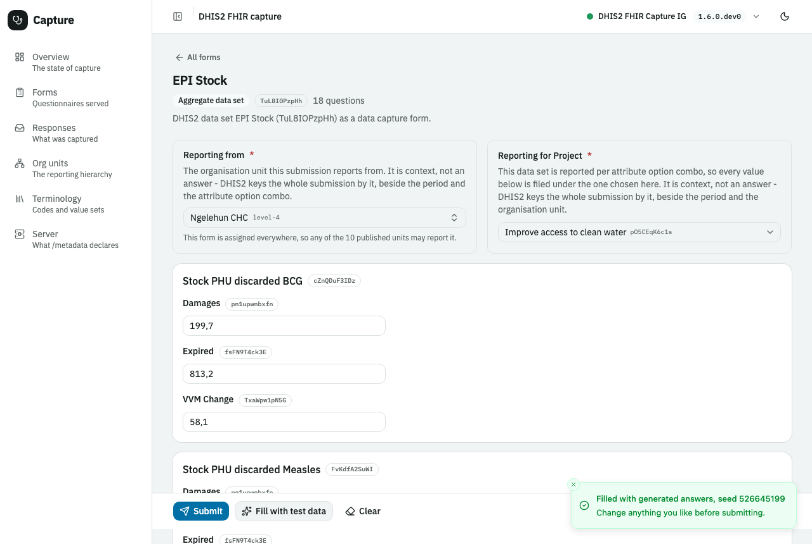

**Fill with test data** answers the whole form from `$generate` and puts the
answers *into the form* rather than posting them - so you can change one
field and submit that. The seed it drew lands in the **Seed** box beside the
button; the same seed reproduces the same answers, so a form that misbehaved
can be asked for again by typing that number back in. **Clear** empties it.
**Submit** posts a `QuestionnaireResponse` and takes you to Responses.

The context that submission carries - the reporting period, the tracked
entity and enrollment on a tracker form - comes from `$generate` too: the
page keeps the skeleton's envelope and replaces only its answers. That is
why a form filled in here is accepted by the same server's validator without
you naming a period anywhere, and also why the submission reports for
whichever period `$generate` chose.

!!! warning "This is a capture UI for exercising a guide"
    It is not a data-entry client for a district office. Submissions carry
    generated context, the server holds no instance data, and nothing is
    written to DHIS2 until you run
    [`d2w fhir forward`](201-forward.md).

Two facts about the submission are yours rather than the server's, and they
sit above the questions - both visible in the screenshot:

- **Reporting from** is the organisation unit the capture reports for.
  `$generate` draws a unit the form admits, so the control opens already
  answered and Submit is never blocked on it. What it offers is the
  published registry narrowed to the form's own organisation-unit assignment
  - exactly the set the facade grades a submission against, so the control
  cannot produce a capture the server refuses with `E1029`. It says how large
  that set is - *1166 organisation units are assigned to this form* - and what
  stepping outside it would cost. Search by name, uid, or DHIS2 code, or
  switch the popover to **Browse** and walk the hierarchy, where units the
  assignment does not name are shown disabled as the parent chain that tells
  two facilities of the same name apart.

    **The unit you choose sticks for the browser tab**, so the next form opens
    reporting from it - a morning spent filing for one facility is one choice,
    not one per form. The control says so under itself. It is a fact about
    what you are doing right now rather than a setting: a fresh tab starts
    fresh, which is also what makes two tabs open on two facilities something
    you can do, and a browser that refuses storage simply keeps nothing and
    opens each form on the server's own draw.
- Beside it, for a data set on a non-default category combo, is the
  **attribute option combo** the whole submission is filed under. It opens
  *Not chosen* and blocks Submit until it has a value, because nothing derives
  it - `$generate` files its skeleton under one so the skeleton is postable,
  and adopting that pick would make every submission nobody read claim to be
  filed under whichever project a random draw landed on. DHIS2's own capture
  app refuses to render the form at all until the combo is chosen; this is the
  same refusal in this app's idiom. **Fill with test data** still adopts the
  fresh draw, because that is the server proposing a whole submission rather
  than a form waiting to be filled in.
- On an aggregate form, the **Reporting period** the submission reports for is
  required too, and knows what to ask for: the form declares its data set's
  DHIS2 period type, so the control offers recent periods *of that type* - the
  current one and the twelve before it, or eight quarters, or five years - in
  the words a person reports in, *July 2026*, with the identifier DHIS2 keys by
  beside it. Most recent first; the control opens on the period the draft
  states, which is the last complete one. `Daily`, `Weekly`, `Monthly`,
  `BiMonthly`, `Quarterly`, `SixMonthly` and `Yearly` are counted back through
  the calendar; a week is named by its ISO number and the Monday it opens on,
  *Week 34, 2026 (starts Mon 17 Aug)*.
- **Other period** takes any period at all. It opens the identifier box, with
  the type's shape as the placeholder and the worked example beneath it - which
  is what a figure corrected two years later is stated in, and what a period
  type with no list arrives as. `BiWeekly`, the offset weeks (`2026WedW30`) and
  the financial years (`2026April`) number themselves from an offset this UI
  does not hold, so it offers no list of them rather than a list of periods
  DHIS2 might not have. The shapes are still checked in the browser, so `july`
  is refused under the cursor rather than after a round trip; a type with no
  shape stated is accepted as typed and graded by the server, whose refusal
  names both types.

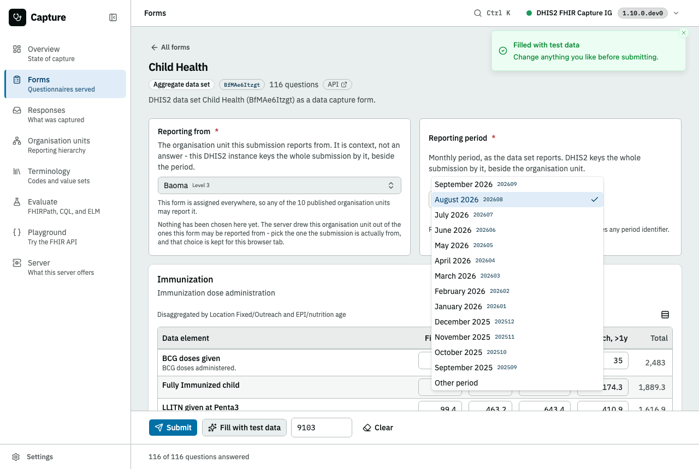

A tracker registration form shows a third block: the enrollment it is about to
file - when it begins, the incident date when the program collects one, and
the DHIS2 uid the enrollment will be created under. None of the three is a
question on the form, so all three come off the `$generate` envelope; the two
dates are editable and ride the envelope in the slot the draft put them in,
because a registration typed up on Thursday is not a registration filed on
Thursday, while the minted uid is stated and not asked.

**The dates wear the words the instance uses for them.** DHIS2 lets a
programme rename all three, and a generated form carries whatever the
instance states on `D2DateLabels`. On the Sierra Leone demo database the
Child Programme's registration form reads *Date of enrollment* and *Date of
birth* - the second being that programme's own word for the incident date,
which is the whole reason the label is read off the instance rather than
guessed. The controls fall back to this project's own fact-stating words
(*Enrollment date*, *Incident date*, *Visit date*) for a date the instance
renamed not at all. The receipt page labels the same facts through the same
function, so a programme's own word for a date reads the same on the form and
on the receipt rather than in one place out of two.

### Who a registration is about

Both registration kinds - a tracker registration and a person-only form -
carry a **Person** control beside the other envelope facts. It opens on
**New person**, which mints an identity for somebody the instance has never
seen, and that is the whole of what the control does on a server publishing no
search over this form's register - a server serving a compiled guide publishes
none - and the control says so rather than offering a search that would always
fail.

A **live** server publishes `GET /{RegisterType}?identifier=` per served
register - the form's `subjectType` says which one its registrations land in,
`Patient` only by default - and then the control
offers a second option, **Find in this DHIS2 instance**. Type an identifier
value and the search runs against the instance once the typing stops. What it
searches is stated on the control: the identifier values DHIS2 holds - the
tracked entity uid, and the values of the attributes DHIS2 declares unique.
Not names. DHIS2 states no attribute that means a name, so the served
projection carries none and this box would be lying if it claimed to search
them. Each result is shown as what the projection carries, with the value of a
unique attribute leading, the rest of the attribute values beside it, and the
tracked entity uid last.

Choosing a person changes the submission in three ways, and the screen shows
all three:

- **The subject becomes their real tracked-entity uid**, in place of the one
  `$generate` minted - so the submission is about somebody DHIS2 already has.
- **The submission carries `D2SubjectExists`**, which is what tells
  [`d2w fhir forward`](201-forward.md) to write onto that person rather than
  create one.
- **The entity-level questions go read-only and are cleared.** Those are the
  ones DHIS2 writes onto the person rather than onto the enrollment (the form
  states which on each question, as `D2EntityLevel`), and the instance already
  holds this person's values for them. This is not tidiness: the forwarder
  **refuses** a submission that states its subject exists and carries one
  anyway, naming each such answer. Change it on that person's own record in
  DHIS2, or register a new person instead.

Their existing enrollments are listed underneath, read from the instance -
program name where this project's guide publishes one, the enrollment's state
in words, when it began, and where. A completed enrollment carries a warning,
because DHIS2 accepts new events into one with no error and no warning at all
(BUGS.md 70), so this is the only place anyone is told.

A tracker *stage* form asks instead of showing: **Answering for** is the
enrollment this event reports against, and it is the one piece of envelope
context you choose rather than inherit. The `$generate` skeleton proposes one
- the pair a registration receipt of this program minted, newest forwarded
first - and mints identifiers of its own only where this server holds no
registration of the program to answer against, which is the one case a stage
submission is refused at forward time. What the picker offers is every real
pair this server's own registration receipts minted, each labelled with its
uid, its enrollment date, and its lifecycle:
a forwarded registration names objects DHIS2 already holds, a received one
will only after `d2w fhir forward` runs - still pickable, and the wait is
said inline rather than discovered at forward time. Rejected registrations
are never offered. The default is the newest forwarded pair, so an ordinary
submission lands; with nothing to offer, the synthetic draw stands and the
page links to the registration form to capture first.

On a **live** server the picker also offers a second source, **Enrollments in
this DHIS2 instance** - the receipts captured here stay the default, and this
is the addition. Find the person with the same identifier search the
registration form uses, and their enrollments **in this form's own program**
become choosable, each with its uid, when it began, and the organisation unit
it sits at. Their enrollments in other programs are not offered at all,
because DHIS2 refuses an event filed against an enrollment in a program the
event does not belong to. A completed enrollment is offered and carries the
warning it earns: DHIS2 will take the event without complaint, so choosing it
is deliberate. Choosing one sets both halves of the pair, and both are DHIS2's
own - a submission built from it imports with no forwarder run standing
between it and the instance.

A refused submission does not vanish into a toast: the validator's
OperationOutcome is rendered issue by issue above the buttons, each with its
severity, its code, and the question it is about - usually enough to fix the
form without opening a terminal.

## Responses, and the receipt

**Responses** is every receipt this server holds, newest first: when it
arrived, which form it answers, the DHIS2 capture model that form came from,
how many answers it carries, its receipt id, and - the column that matters -
**which lifecycle state it is in**. `Received` is the queue
[`d2w fhir forward`](201-forward.md) drains, `Forwarded` means DHIS2 took it,
`Rejected` means DHIS2 refused it, and `Withdrawn` means it landed and
[`d2w fhir withdraw`](201-forward.md#withdraw-what-you-forwarded) retracted it afterwards. Two filters sit above the table: the
lifecycle states as a button group, each carrying its own count, and a form
picker for narrowing to one questionnaire. The state filter lives in the URL
(`#/responses?lifecycle=rejected`), which is what lets the Overview's tiles
link straight into a narrowed table.

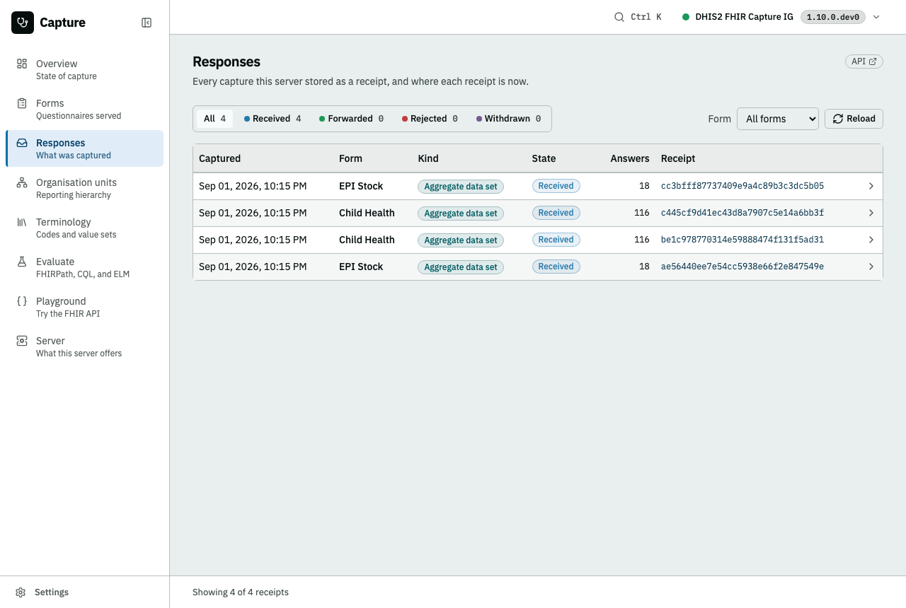

**A row opens the receipt as a sheet over the table**, which is the posture the
page is for: reading down a spool one receipt at a time without losing the
filter or the place in the table. The address gains `?open=<id>` while the sheet
is up, and Esc closes it.

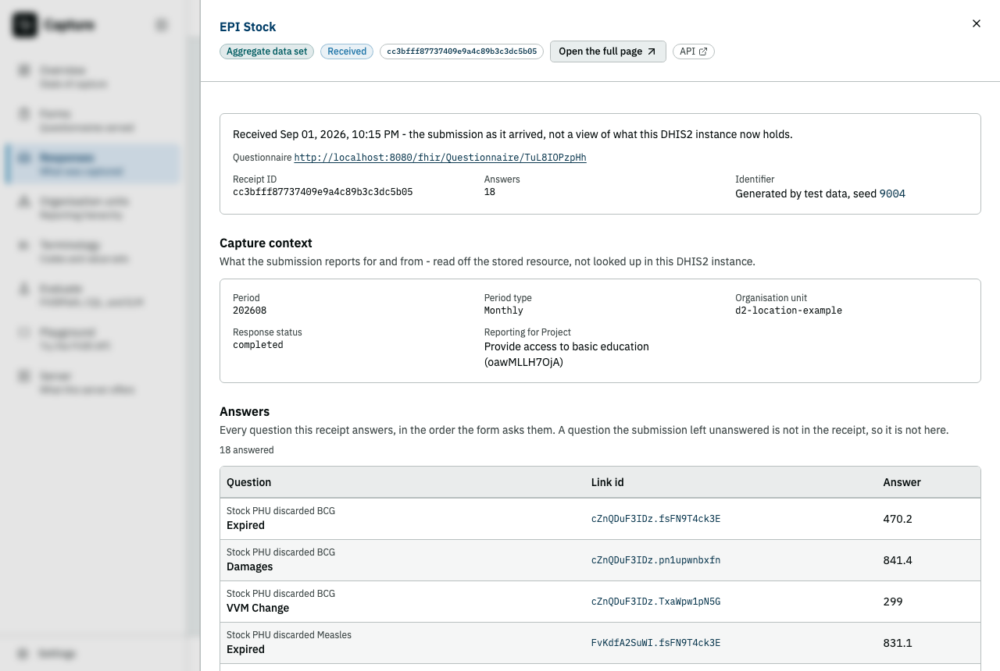

**Open the full page** takes the same receipt to `/responses/{id}`, which is the
address to send somebody - one receipt is a link:

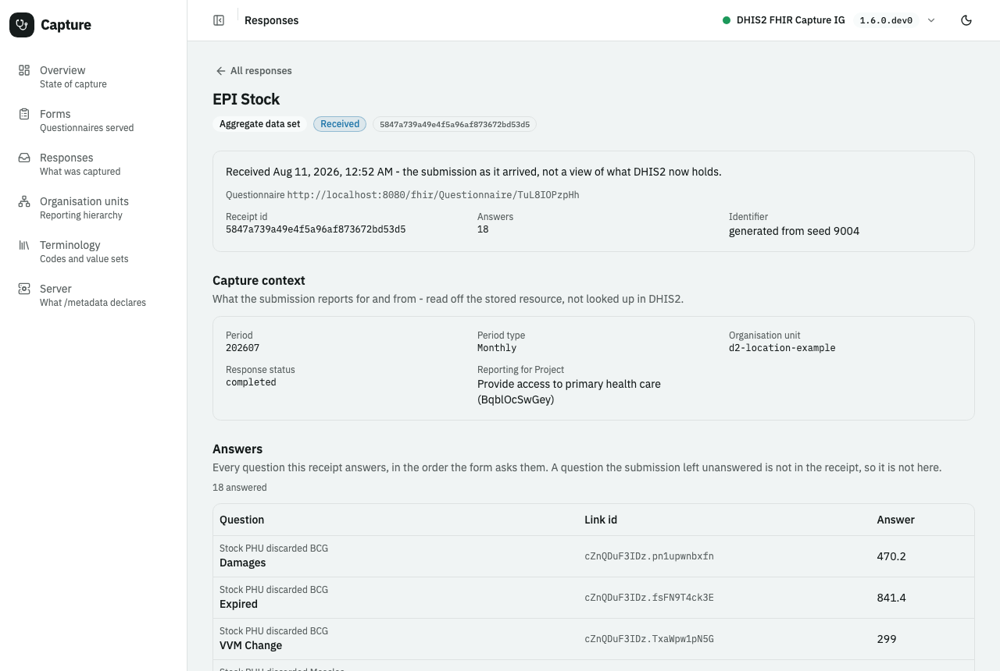

The page reads the served `Questionnaire` as well as the receipt and puts
them side by side: the question text in the order the form asks it, with its
enclosing groups - which is what turns a disaggregated cell from
`Fixed, <1y` into `Immunization / BCG doses given - Fixed, <1y` - the link
id beside it, and the value rendered as what it is. A coded answer keeps
both its display and the code DHIS2 will store, a boolean reads as Yes or
No, and an organisation-unit answer reads as the place it names, with the
uid beside it. Above the answers sits the capture context the receipt
states - period, organisation unit, tracked entity and enrollment where the
kind carries them - and, when the receipt came from `$generate`, the seed it
was drawn from. Capture warnings get a section, a rejection gets the import
report the forwarder stored beside the receipt, and a collapsible **Raw
QuestionnaireResponse** shows the stored document itself, so the page can be
checked against the bytes.

**A withdrawn receipt says what the instance keeps.** DHIS2 soft-deletes, so
the row stays there carrying its value and is gone from every ordinary read -
and the page states that rather than the word "deleted", with the instant the
withdrawal was posted inside the sentence: *Withdrawn from DHIS2 at &lt;instant&gt;.
This DHIS2 instance keeps a hidden copy of the event; it no longer appears in
reports. The UID is burned, so this receipt can never be forwarded again.*
The note is written once, in the package that posts the delete, and
the page drops only its opening "Withdrawn." because the line has already said
it. The DHIS2 event it named sits beside it. The answers stay on the page,
because retracting data from an instance does not unsay the submission that
was made.

**A rejection about a program rule reads as the rule's own name.** DHIS2
refuses a tracker import that breaks one with `E1300`, and it names the rule by
uid inside its own sentence - *Generated by ProgramRule (`dahuKlP7jR2`)*. The
served form is where that uid has a name, so the page joins the two and puts
the name above what DHIS2 said: *The haemoglobin value cannot be above 99*, and
the instance's own sentence beneath it, unedited. The uid stays in the row,
because it is the string to type into DHIS2. A rule the served form does not
list - added to the instance since the capture, or on a form recompiled since -
stays unnamed rather than guessed at, and the row still shows everything DHIS2
said. The `subject` of an `E1300` row is the *data element* the rule read, not
the rule, so it is only read as a rule when the form lists it as one.

The lifecycle is which of
`.serve/responses/{received,forwarded,rejected,withdrawn}/` the file is in, and
the server re-reads that directory to answer. So running `d2w fhir forward` or
`d2w fhir withdraw` in another terminal changes what this page shows with
nothing restarted - hit **Reload**, or just switch back to the browser,
which refetches on focus.

## The register

A **live** server carries one more page, at `#/tracked-entities`: the people -
or the specimen batches, or the herds - the DHIS2 instance holds. It is in the
navigation only when this server answers about the instance's tracked entities
- a compiled guide has no instance behind it, and a project that states
`[serve.tracked_entities] enabled = false` has said it does not want the
surface at all
([Configure serving](301-serving.md#tracked_entities)). In both cases there is no
page, rather than a page that apologises.

!!! note "The page is named for what the instance actually tracks"
    A run serving one tracked entity type is led to, and headed, by the
    instance's own name for that type - **Person**, **Fridge**,
    **Specimen batch** - singular and unpluralised, because the string is
    DHIS2's rather than this project's to inflect. That is the name the people
    running the server say. It is not **Patients**: `Patient` is the FHIR
    resource this project projects a person onto
    ([what goes in](301-what-goes-in.md#tracked_entity_types)), and naming a
    page for a projection states this project's word where the instance has one
    of its own. A run serving several types has no single name to use, so it is
    led to by **Tracked entities** and the page behind it holds one section per
    kind, each titled by the names the instance holds for the types riding it.
    Everything below is the same either way, section for section.

Everything on it is read from the instance while you wait, which is the one way
it differs from every other page here. Responses shows receipts - what was
submitted. This shows what DHIS2 holds right now.

**Two ways to arrive at a person, and the page offers both.** Type an
identifier - a card number, a register number, whatever value the person is
known by - and the search runs once the typing stops; it is the same search the
registration form's **Person** control runs. It looks under every attribute DHIS2
declares unique **or** searchable, which is what makes finding a woman by her
first name work where the instance marks that attribute searchable - and it means
a search can honestly come back with several people who share a value, which the
list below is already the shape for. What it never does is guess: there is no
attribute it treats as a name because DHIS2 declares none. Type nothing and the
page lists the people the instance holds, twenty-five at a time, with **Next**
and **Previous** underneath. Searching is for a clerk holding a card; browsing is
for one who is not.

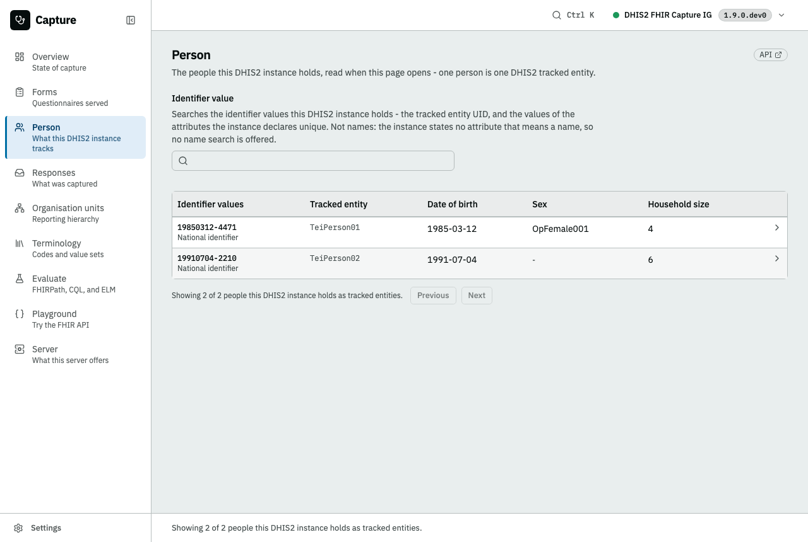

!!! note "A project keeping a synced copy searches wider, and the box says so"
    `/metadata` is what decides which search the box sends, read before anything
    is typed. A facade asking DHIS2 directly declares `identifier`, and the box
    is labelled **Identifier value**. A project with
    `[serve.search] backend = "projection"` keeps a synced copy of the instance
    it can search itself, declares `_content` beside `identifier`, and the box
    becomes **Any value a record holds**: any part of any value the record
    carries, upper and lower case alike, so a fragment of a surname finds
    somebody where an identifier search could not. The parameter is spelled
    `_content` and not `name` for the reason the whole register is built on -
    DHIS2 states no attribute that means a name, and neither the server nor the
    box will pick one to be it. See
    [Configure serving](301-serving.md) for the two tables that turn it on.

**How old the answer is, said once.** An answer from a synced copy is not an
answer from the instance, and the page says which it was: *Answered from the
synced copy of this DHIS2 instance, as of 21 Aug 2026, 23:56* sits under the
rows, read from the header the server sends beside them. A copy nothing has
filled yet gets the server's own sentence about that instead. A facade asking
DHIS2 itself states no line, because there is nothing to say about rows read a
moment ago.

The screen asks for its own page of twenty-five;
`[serve.tracked_entities] page_size` is what the endpoint answers a caller that
asks for no size at all, and `page_size_limit` caps what any caller may ask for
([Configure serving](301-serving.md#tracked_entities)). A project that states
`listing = false` has kept the search and dropped the browsing: the page then
opens on its search box alone, with nothing to page through. That is a posture
rather than a fault - looking up somebody a clerk can already name is a
different act from paging through everyone an instance holds, and a deployment
may offer the first without the second.

A count of all the people sits with the paging controls when DHIS2 states one -
*Showing 25 of 515 people this DHIS2 instance holds as tracked entities* - and
stays away when it does not, because the instance does not always count what it
pages and "137 people" is worth showing only when it is true. Where there is no
count, the paging controls are the whole of what the page claims: there is a
next page or there is not.

**One FHIR resource is one register over every tracked entity type the
published map takes onto it, and a register over several offers the choice
between them.** A row of chips above the table - **All**, then one per type,
under the name the instance holds for it - narrows the table, the search box,
and the address alike: choosing **Fridge** sends `_tag=<uid>` on both reads and
puts `?type=<uid>` in the address, so a narrowed register is a link somebody can
be sent. The chips come from the server's own declaration: `/uiconfig` states
the types riding each register and `/metadata` documents the same set under the
`_tag` parameter that narrows to one of them
([Consume the FHIR API](401-consume-the-fhir-api.md)). A register serving one
type has nothing to choose between and shows no chips at all. Narrowing starts
the paging again at the server's first page, because a page token names a place
inside a scope and means nothing in the scope next door.

**What a row shows is what the server states about a person, and nothing
more.** The identifier values that name them - the values of the attributes
DHIS2 declares unique, each labelled with the attribute it belongs to - then the
DHIS2 tracked entity uid, then a column per attribute the people on that page
hold a value of, the attribute named once in the header and the value alone in
the cell. There is no name column. DHIS2 states no attribute that means a name -
which of an instance's attributes carry one is that instance's own decision - so
a name column would be this page guessing, and a wrong name on a person's row is
worse than no name at all.

**A column nothing on the page has anything in is not drawn.** An instance whose
tracked entity type declares no unique attribute holds no identifier value for
anybody, and the identifier column goes rather than standing there full of
dashes on every row; it comes back the moment a page carries one. The tracked
entity type is a column only while several types are on screen, which is a
register serving more than one with no chip chosen - one type on every row is
the page's own title stated once per person.

**Which attributes get the columns is DHIS2's choice where DHIS2 made one.** An
administrator marks the attributes that belong in a list of a type's entities -
the two or three that let a clerk recognise somebody - and the published
`D2TEA_CS` carries that marking, so those lead whatever order the projection
arrived in. An instance that marks none states no preference and the columns
keep the projection's order. Five columns is the cap, because past a handful
rows stop being readable side by side; a page whose records hold more says so
underneath - *This table shows 5 of the 9 attributes these records hold* - and
the detail below keeps showing every value, marked or not.

**A row opens that person.** The page is headed by the value that names them -
the value of an attribute DHIS2 declares unique - with the tracked entity uid
badged beneath it. Where this instance holds no unique value at all, the uid is
the heading and the badge is dropped: one string stated twice, once large and
once small, reads as two facts about two things. The detail below is the same
three facts laid out to be read: the identifiers they are findable by, each
named for the attribute whose value it is; every attribute value the instance holds for them, including
the ones collected at a programme rather than at registration; and the
programmes they are enrolled in - the name this project publishes for the
programme where it publishes one, the state of the enrollment in words, when it
began, and the organisation unit it sits at.

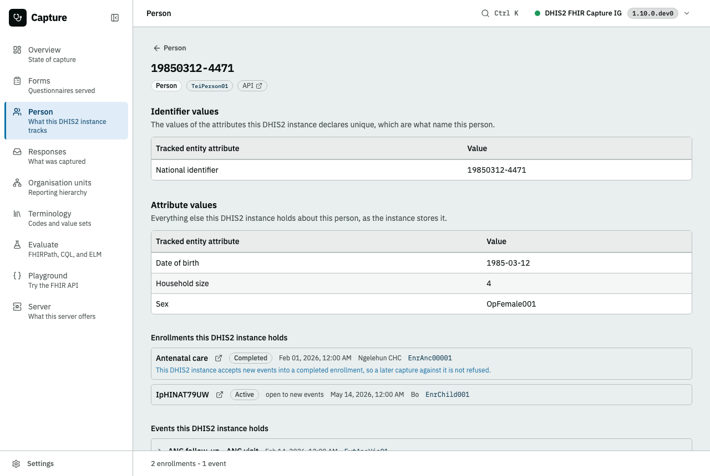

!!! warning "A completed enrollment is listed, and said to be completed"
    DHIS2 accepts a new event into a completed enrollment with no error and no
    warning at all (BUGS.md 70). So a completed enrollment is shown rather than
    hidden - it is a fact about the person, and hiding it would leave somebody
    wondering where a programme went - and it carries the warning it earns,
    because capturing into a closed episode should be a decision somebody made
    on purpose.

## The other pages

- **Organisation units** is the reporting hierarchy, laid out like a GIS
  tool: on a wide viewport, three resizable panes - the hierarchy tree, the
  map as the always-visible centre canvas, and an inspector rail that opens
  when you pick an organisation unit (narrower viewports get two columns
  with the same sections behind tabs). The rail opens with the selected
  unit's identity - name, level, identifiers, the clickable parent chain -
  and stacks its sections under it: **Data sets**, **Programs**, and
  **Tracked entity registration** are the forms reportable at that unit,
  shelved by their DHIS2 kind with a tracker program's registration and
  stages grouped together. What the shelves list is what an assignment names -
  the join that says which submissions this unit can make without DHIS2
  refusing them with `E1029` - and a registration-only form appears at every
  unit, because DHIS2 hangs no assignment on a tracked entity type;
  **Captured here** is the receipts this server holds
  for captures at that unit, linked into Responses; **Children** is the
  subtree as a mini tree, and selecting a row re-roots the rail. The map
  draws the published boundaries and points over the raster layers
  `[serve.basemaps]` names (see [Configure serving](301-serving.md)), and a
  layers control in the corner offers each of them plus **None** - so a
  reader can put the boundaries on a plain canvas at any moment, and a
  project offering no layer (`basemaps = []`) reaches no origin but this
  server, which is what an air-gapped deployment wants. The selected
  unit is lit in amber against the blue wash of the units below it, and the
  selection rides the URL (`#/organisation-units?unit=<uid>`), so an
  organisation unit is a link you can send. Clicking is two gestures: a
  left-click on a shape opens a popup naming the unit - its level, its
  parent, what sits below - with **Select** selecting it, and while the map
  is still too far out for a click to have meant one shape it eases a step
  in toward the pointer instead; a right-click drills straight to the
  selection at any zoom. The corner controls are fullscreen, a globe toggle
  that switches the projection in place and hangs the sphere in a
  starfield, the layers control, and a recenter button back to whatever the
  map is framing - the selection's extent, or the whole registry.

    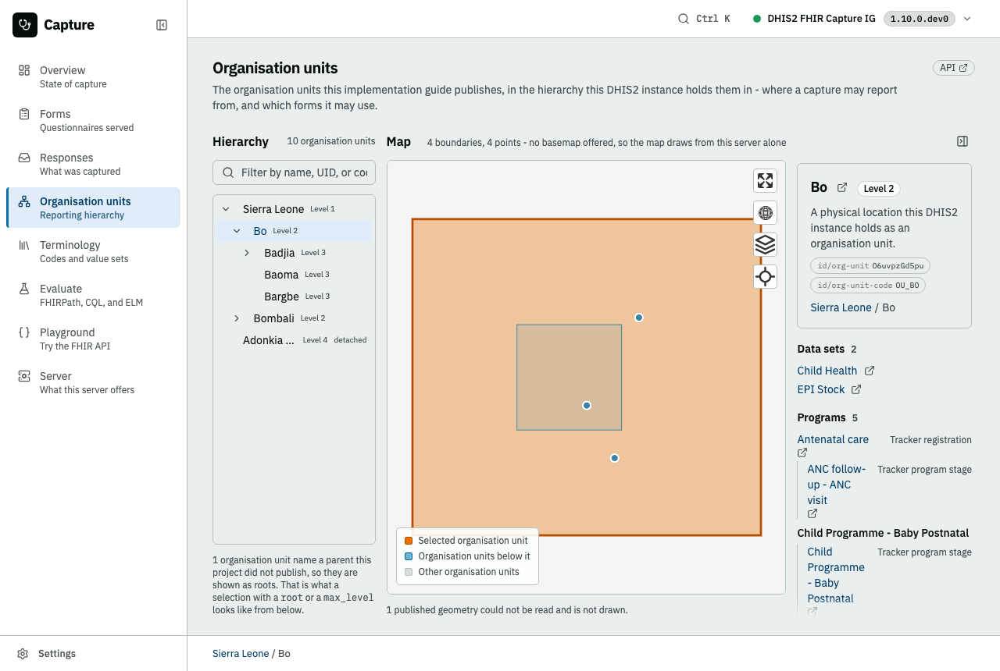

- **Terminology** is a browser over the code systems, value sets, and
  concept maps the project publishes - concept tables with the DHIS2
  identifiers beside the concept codes, and a `$translate` tester on the
  detail pages, answering from the running server exactly as
  `d2w fhir forward` resolves a coded answer.

    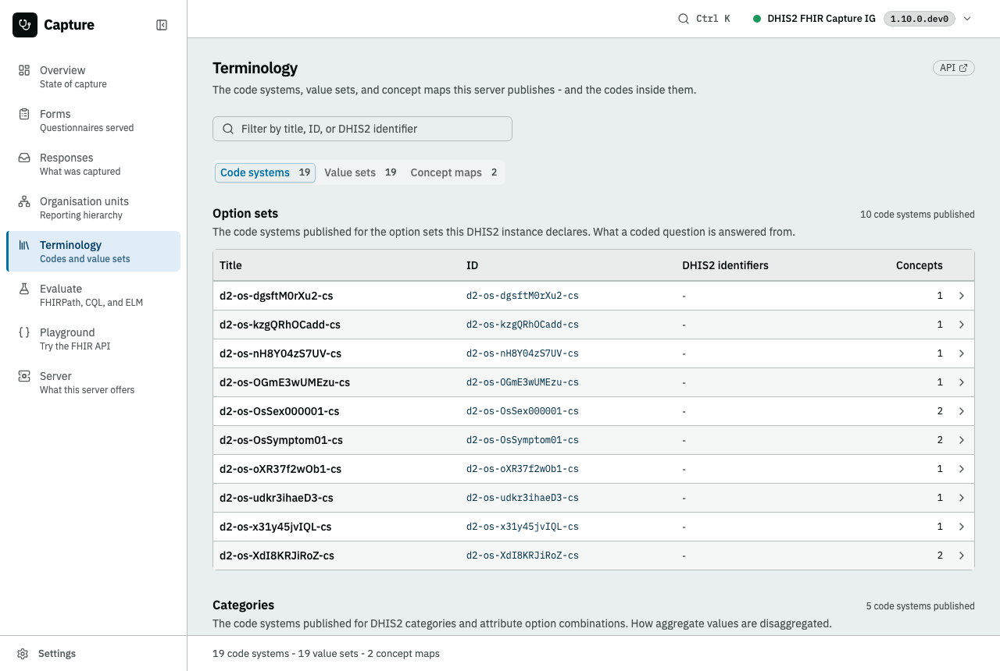

    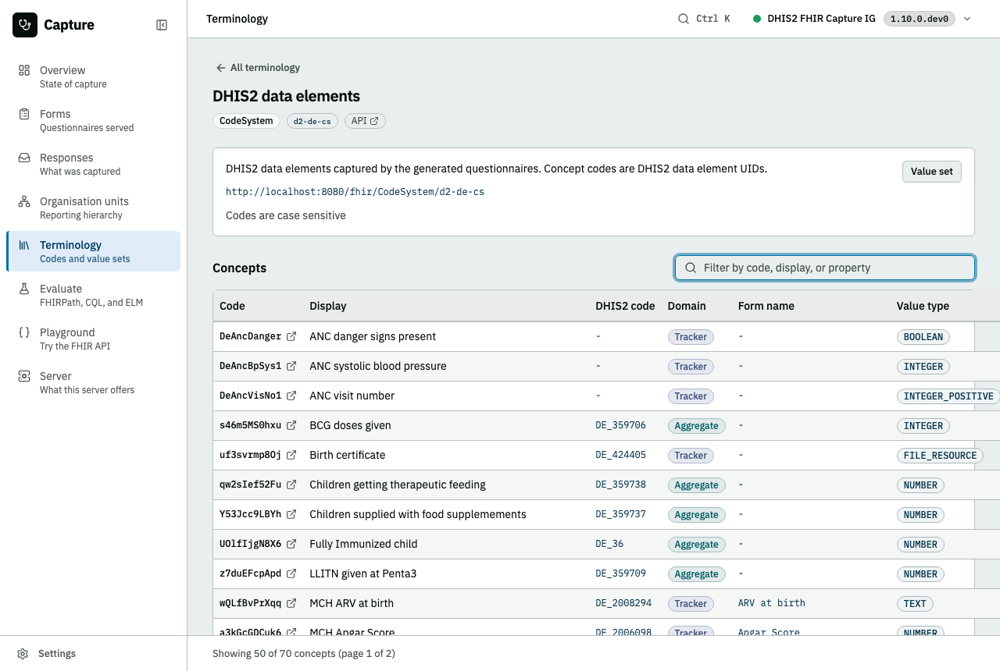

- **Evaluate** is a place to run one expression and see what this server
  answers: pick FHIRPath, CQL, or a compiled ELM library, pick what it runs
  over - a resource pasted below, a resource from this guide, a person this
  DHIS2 instance holds, or nothing at all - and press **Evaluate**. It opens
  with an empty expression over a simple Patient context, and the examples
  panel beside the editor loads one in a click. An expression that does not
  parse is an answer here rather than an error: the server reports the line
  and the column its parser stopped on, and the screen shows that line with a
  caret under the character. See [FHIRPath](501-fhirpath.md) and
  [CQL](501-cql.md) for the languages themselves.

    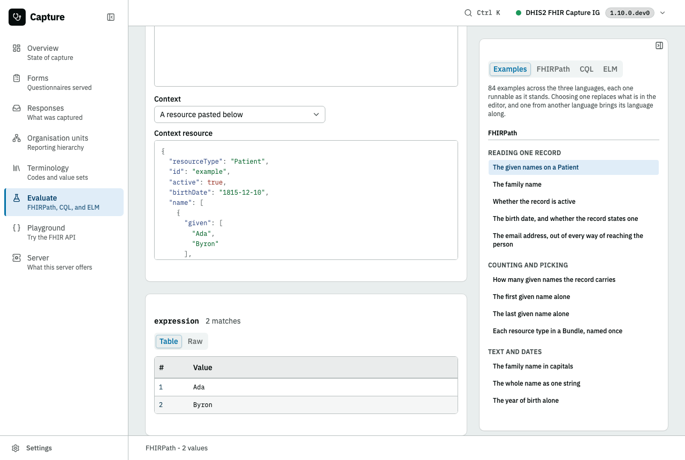

- **Playground** is the API itself with the reading taken off: build a request,
  send it, and read the bytes under the status code. It is the page an
  integration starts from, and [The Playground](#the-playground) below is the
  whole of it.
- **Server** renders `/metadata` in full: the declared operations, and per
  resource type the interactions, the search parameter names, and the profile
  count, with each type's row unfolding into the server's own prose - the
  type's paragraph and every parameter's contract, a register's filterable
  attributes as a table. The conformance document itself sits behind a
  **Raw CapabilityStatement** toggle - this document is the facade's whole
  contract, and the tables above it show the parts a browser needed. The
  header's reachability light and the
  server's self-description are worth a glance before blaming a form: a UI
  pointed at a stale `--live` process and one pointed at a freshly compiled
  IG look identical until you read the conformance document.

    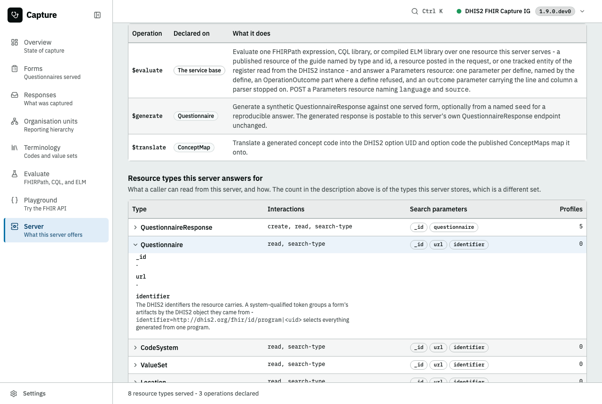

### The reference beside the editor

The Evaluate screen opens with a panel to the right of the box, on two tabs, and
**Reference** in the toolbar folds it away.

**Examples** is every worked expression this screen ships, on shelves named for
the kind of question each answers - *Reading one record*, *Reading a Bundle*,
*A filled-in form*, *Queries*, *Lists and intervals*, *Terminology, and what it
refuses* - and one more shelf built from resources this particular server was
found to hold. Each is titled by what it answers rather than by the function it
uses, because somebody scanning a list of thirty is looking for a question like
theirs. Clicking one loads the whole form - the source, the context, the
resource - so the next thing to do is press **Evaluate**. Every one of them runs
as it stands, including against a guide that publishes nothing at all: the
generic ones carry their own data.

The other tab is the language itself, and it is **this engine's** vocabulary
rather than the published specification's. That distinction is the point: a
reference listing the whole of FHIRPath would send somebody to type a function
this engine answers `Unknown function: foo()` to, and a reference is worth
nothing if the server disagrees with it. So the FHIRPath tab is the function
registry and the operator set as implemented; the CQL tab is the header
declarations, the retrieve forms, the query clauses in the order they are
written, and the interval vocabulary; and the ELM tab is what a compiled library
has to carry and which expression nodes the evaluator dispatches on.

Each of the three ends with what the language refuses, stated beside the thing
it is a refusal of - an unknown function, a value set the library never
declared, a value set with no expansion, a library with no identifier. Half of
learning a language here is learning what it says no to, and this engine is
loud about those on purpose: a retrieve whose terminology resolves to nothing
would silently widen from the set the library named to every resource of that
type, which is the loudest possible wrong answer delivered quietly. The
examples include the refusals for the same reason - meeting one here, with the
whole message on screen, is cheaper than meeting it for the first time inside a
measure nobody can explain.

**The boxes are real editors.** Source and the pasted context are CodeMirror,
so JSON gets its own grammar and brace matching, and FHIRPath and CQL get
keywords, strings, comments, and date literals told apart from one another. The
same rendering paints the JSON results underneath, the receipt page's **Raw
QuestionnaireResponse**, and the Server page's **Raw CapabilityStatement**, in
whichever theme and on whichever ground the header is set to.

## The Playground

Every other page in this app is a reading of the API: Forms is a
`GET /Questionnaire` laid out as cards, Server is `GET /metadata` laid out as
tables. **Playground** is the other thing - one request, sent to this same
server, answered in the box below it, JSON first. It is where an integration
starts, because the question a client author has is what the address is and what
comes back, and everywhere else in the app that has been answered for them.

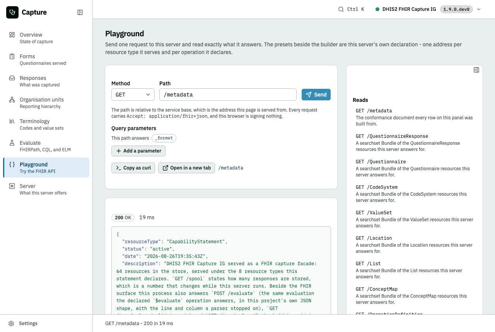

**The builder** is a method (`GET` or `POST`, the two this facade answers), a
path relative to the service base, and query parameters as rows rather than as
one long line to proofread. The address the three add up to is printed under
the buttons, so there is never a question about what **Send** would send. A path
pasted with its query already on it keeps it and the rows are appended, because
both halves are things you typed. A `POST` gets a JSON body in the same
CodeMirror editor the Evaluate screen writes expressions in.

Every request goes to this same origin, carries
`Accept: application/fhir+json`, and is signed with whatever credential this
browser holds - the same one every other page here signs with, so a request that
works on this page works on the others and the other way round.

**The presets** beside the builder are this server's own declaration, read back
as addresses: `/metadata`, one search per resource type the CapabilityStatement
says answers a search, the read-by-id shape, and one row per declared operation:
`$generate` on Questionnaire, `$translate` on ConceptMap, and `$evaluate` at the
service base. A guide that publishes no ConceptMaps declares no `$translate` and
is offered no row for it. Three of the rows name a resource, and the page reads
one of each off this server so they answer on the first press rather than
carrying a `{id}` you have to fill in; where the guide publishes neither, the
row says the placeholder has to be replaced. Choosing a row fills the builder
and stops there - half of what this screen teaches is what an address is made
of, and a row that fired on click would answer before you had read it.

**The answer** is the status code, the round trip in milliseconds, and the body
pretty-printed in the same block the receipt page and the Server page render
JSON in. An `OperationOutcome` lands in that block like anything else: on this
facade a refusal is a FHIR resource saying why, and a page that hid it behind a
red card would teach the opposite of what the server does. The one thing that is
not an answer is a request nothing responded to, which says so in its own words.

**Two ways out of the browser.** **Open in a new tab** takes a `GET` to its own
address with `_format=json` on it, which is how a caller asks for JSON where the
header is not theirs to set. **Copy as curl** writes the current request as a
command that runs in a terminal, single-quoted throughout so a query string, a
JSON body, and a FHIRPath expression carrying its own quotes all survive the
paste. Where this browser is signed in, the command names the `Authorization`
header and its scheme and puts a placeholder where the credential would be: the
command is for pasting into a ticket or a chat window, and a live credential
must not travel with it.

**Sent requests** under the answer is the last twenty this browser sent - method,
address, status - and choosing one puts the whole request back in the builder,
query rows and body included. It lives in this browser's own storage and reaches
no server.

## The query behind every screen

**Every screen that reads a resource names the query it read, and the name is a
link.** It sits beside the page's own heading - a small **API** chip with an
arrow on it - and it opens the server's answer in a new tab, in the format the
server publishes. Server opens `/metadata`, Forms opens `/Questionnaire`, a form
opens `/Questionnaire/{id}`, Terminology opens the tab you are on, a receipt
opens `/QuestionnaireResponse/{id}`, an organisation unit opens `/Location/{id}`.

The register's chip is the interesting one: it carries whatever the page is
currently narrowed by - the value typed in the box, the tracked entity type
chosen, the attribute filter - so the link always opens the query the table on
screen is the answer to, rather than the bare route.

Every one of those links carries `_format=json`, which is R4's way of asking a
server for its format from a place that cannot set an `Accept` header. Without
it a browser following the link would be refused with a 406, because the FHIR
surface answers `application/fhir+json` and a browser asks for markup. See
[`Accept` and the service base](401-consume-the-fhir-api.md#accept-and-the-service-base).

This is what the UI is for as much as capture is. The facade exists to be
integrated against, and an integrator reading a page here can copy the query
behind it into their own client without reconstructing it from documentation.
Evaluate carries no chip: `$evaluate` is a POST, and there is no URL to open.

## Getting anywhere: Cmd+K

**Cmd+K** on a Mac, **Ctrl+K** everywhere else, opens a command palette over
whatever page you are on - and the magnifying glass in the header opens the same
thing for anyone who was never told about the chord. Type, and it narrows:

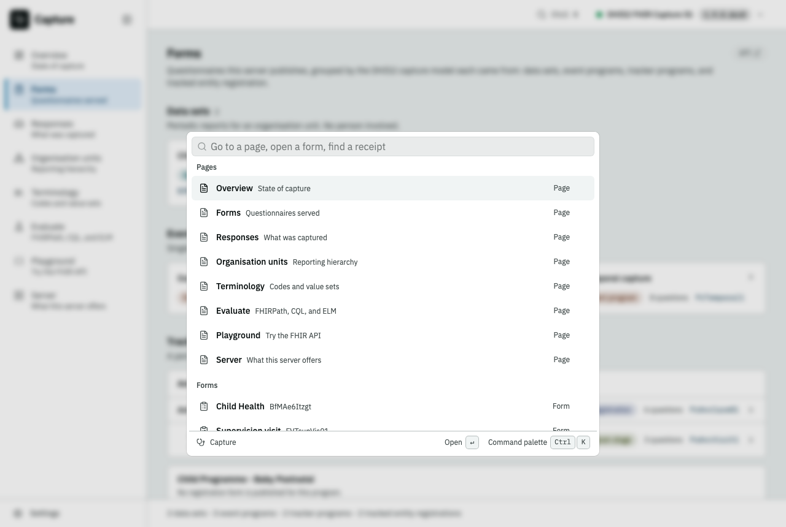

- **Pages** - every page this run offers, under the name this run gives it. A
  server with no DHIS2 instance behind it offers no register, so no register row
  is on the list either.
- **Forms** - every Questionnaire the served guide publishes, by title, with the
  id it is served under beneath. Choosing one opens the form.
- **Responses** - the newest few receipts at rest, and the ones a typed id
  prefix names once you have typed two characters or more. It matches the START
  of a receipt id, which is what a `d2w fhir forward` run prints and what you
  have in hand when you come looking; filtering and counting receipts is the
  Responses page's job, not this one's.
- **The register** - typing two characters or more offers **Look up "..." in
  Person** (or in whatever this instance calls what it tracks), which opens the
  register with that identifier value already searched for. The search rides the
  address, `#/tracked-entities?q=...`, so the result is a link you can send.
- **Appearance** - the seven themes below, and the switch between the light
  ground and the dark one.
- **View** - **Collapse the navigation**, or **Expand the navigation** when it already is.
- **Help** - **Keyboard shortcuts**, the same list `?` puts up.
- **Session** - **Sign out**, when this tab holds a credential.

Each row is one line: an icon for what kind of thing it is, its name, the line
about it beside the name, and the kind itself - *Page*, *Form*, *Receipt*,
*Theme* - at the right-hand edge. The bar along the bottom says what Return would
do to the highlighted row, and spells the chord for whoever arrived by button.

**Nothing in the palette changes what this server holds.** Every action moves
you, repaints the app, or ends the session. Submitting a form, forwarding a
receipt and withdrawing one all stay where they are - two keystrokes is the
wrong distance from an irreversible act.

**Every chord is a letter.** No row in the palette has a shortcut of its own, and
the two the app does bind sit on K and B: these servers get run from Nordic
keyboards among others, where the bracket, brace, pipe and backslash keys need
Alt to reach at all, and a binding over any of them is one half the room cannot
press.

## Every key: ?

Press **?** anywhere outside a box and the whole list comes up - the palette
chord, the sidebar chord, and the keys every app shares. The key is matched on
the character rather than on a physical key plus Shift, so it works on a
Norwegian layout as it does on a US one, and it stays out of the way whenever an
input, a text area, a select, or one of the Evaluate editors has focus.

| What it does | Key |
| --- | --- |
| Open the command palette | Cmd+K, or Ctrl+K |
| Collapse or expand the sidebar | Cmd+B, or Ctrl+B |
| Open the list of shortcuts | ? |
| Close a dialog, a menu, or the palette | Esc |
| Open the row that has focus | Enter |
| Move through the organisation unit hierarchy | Arrow keys |

**Cmd+B is the platform's modifier and not either one**, because Ctrl+B on macOS
is the "back one character" that text fields and the Evaluate editors both
answer. It fires while a box or an editor has focus - clearing the screen down to
the work in front of you is worth most mid-form.

The list is a section of the settings dialog, so the gear in the lower left leads
to it too - and `?` opens that dialog with the section already selected.

## Settings

**The gear at the foot of the sidebar opens everything you can set about this
app.** A rail down the left names the sections, the one you are in fills the
right, and a box at the top of the rail searches across all of them at once: type
`phosphor` and the rail drops to the section holding the row that says it, with
that row the only one left. Nothing here is saved - a choice applies the instant
it is made, and the dialog stays open in front of it. Collapsed to icons, the
gear stays where it is; on a narrow screen the rail lies down into a strip above
the pane rather than taking a second column.

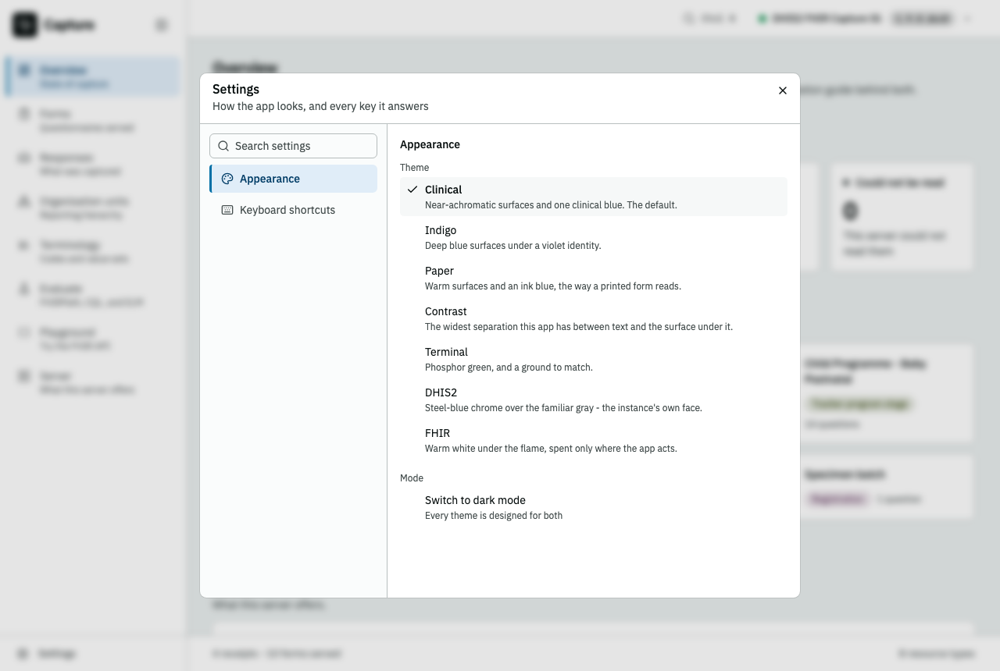

Two sections today:

- **Appearance** - the themes, and the ground they are painted on.
- **Keyboard shortcuts** - the same list `?` puts up. Pressing `?`, or choosing
  the palette's row for it, opens the dialog with this section selected.

### Appearance

Two controls under two headings, because they are two questions: **Theme** is
which of the seven sets of colours the app spends, and **Mode** is the light
ground or the dark one. Every theme is designed for both, and the choice is
remembered in this browser and applied before the first paint, so a reload never
flashes one theme under another.

| Theme | What it looks like |
| --- | --- |
| **Clinical** | Near-achromatic surfaces and one clinical blue. The default, and what a project that chooses nothing is painted in. |
| **Indigo** | Deep blue surfaces under a violet identity. |
| **Paper** | Warm surfaces and an ink blue, the way a printed form reads. |
| **Contrast** | The widest separation this app has between text and the surface under it: achromatic surfaces reaching both ends, muted text most of the way back to the foreground, and borders that are lines rather than hints. |
| **Terminal** | Phosphor green, and a ground to match. |
| **DHIS2** | Steel-blue chrome over the familiar gray - the instance's own face. |
| **FHIR** | Warm white under the flame, spent only where the app acts. |

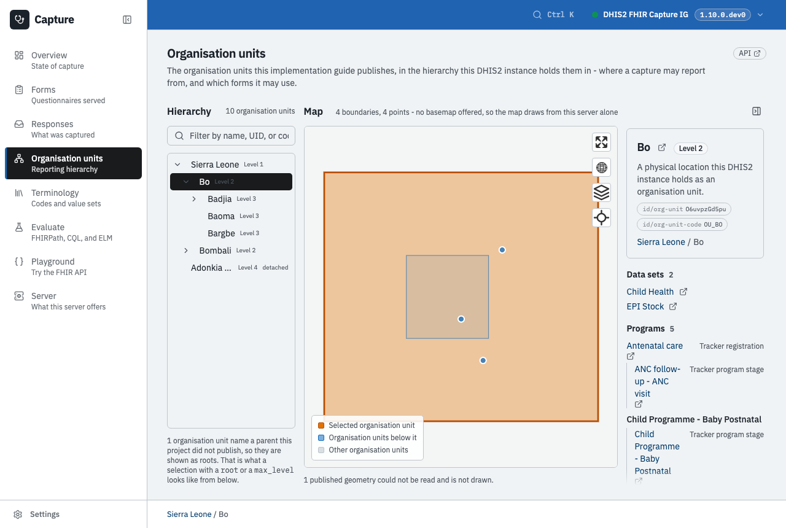

A theme repaints everything the app draws from a token, the source colours in
the Evaluate editors and the organisation-unit map's boundary tiers included.
Nothing else moves: the type, the spacing, and the corner radii are one design
and stay put, so a theme is a palette rather than a second app.

**Every theme paints the same four state hues** - green for accepted, blue for
waiting, red for a refusal, amber for one the guide must answer for - because a
spool colour is a fact rather than a decoration, and a fact does not change
meaning when the walls are repainted. Terminal's phosphor green is its identity,
carried by `--primary` and the cast its uids wear, and it sits beside the
accepted green rather than taking its place.

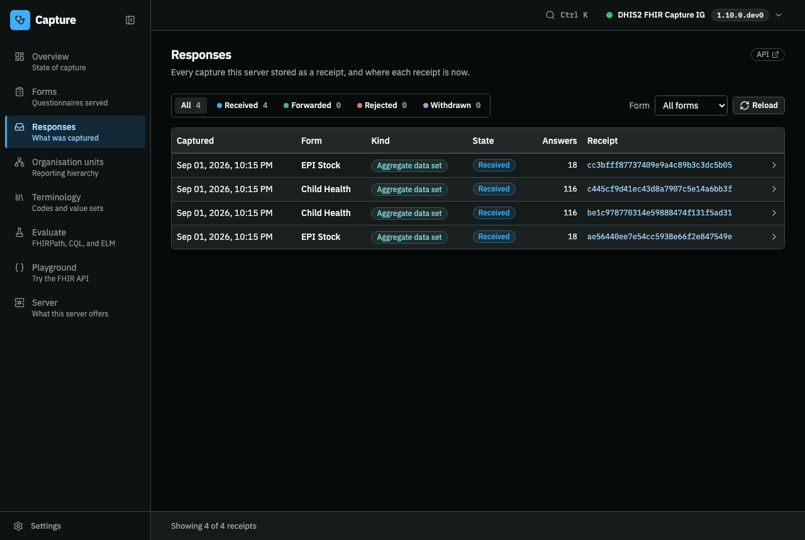

## Opening an identity in DHIS2

Every identity these screens show is a DHIS2 uid: an organisation unit, a data
set, a program, one of its stages, a data element. Reading one here answers
*what the guide published*; the next question is usually *what the instance
holds*, and the screens answer that with a small external-link mark beside the
identity, opening that object's own page in the DHIS2 instance's Metadata
Management app in a new tab. It is there in three places:

- the organisation-unit rail header, beside the selected unit's name;
- each **Data sets** and **Programs** row of that rail, on the data set,
  program, or program stage the form was generated from;
- each concept row of the data-element dictionary (`D2DE_CS`), on the data
  element the concept code is the uid of;
- each enrollment listed on a person's page in the register, which opens that
  enrollment in the instance's **Capture** app rather than in the metadata
  screens - an enrollment is a record about somebody, not a metadata object,
  and Capture is where DHIS2 shows it.

**The links exist only when the server knows which instance to point at.**
The address comes from the DHIS2 profile the serve run resolved (see
[Serve the guide](201-serve.md)). A compiled guide served on a machine that
names no profile carries no links at all - not a disabled control, not a link
to a search page, nothing - because a guide with no named instance behind it
has nowhere honest to point. Only the address ever reaches the browser; the
profile's name and its credentials do not.

!!! note "Which app the metadata links open"
    The **Metadata Management** app, on
    `{base}/dhis-web-metadata-management/index.html#/{collection}/{uid}` - the
    collection being the plural of the object's type. That path redirects into
    2.43's global shell as `/apps/metadata-management`, carrying its own
    fragment along, and the app then adds whichever section it opens on. The
    older Maintenance app is not what these links point at: 2.43 no longer
    lists it in `/api/apps`, and the screens still reachable there banner
    themselves as no longer maintained.

## How the screenshots on this page are made

Every image above is produced by one Playwright spec in the repository,
`packages/dhis2w-fhir-serve/frontend/e2e/docs-screenshots.spec.ts`, which
runs against the same committed fixture project the browser suite tests -
so the forms, counts, and receipts in the shots are reproducible rather
than somebody's laptop state. Each shot is a page or a sub-state this page
describes, at one viewport, and every drawn answer comes from a stated seed
typed into the form's own **Seed** box. The spec is skipped by default (CI
has no business rewriting documentation images); to re-shoot after a UI
change:

```bash
cd packages/dhis2w-fhir-serve/frontend
pnpm build
DOCS_SCREENSHOTS=1 pnpm exec playwright test e2e/docs-screenshots.spec.ts
```

Run it alone, not as part of the full suite, so the spool holds exactly the
receipts the spec posts. The images land in `docs/img/fhir/`; commit them
with the change that moved the UI.

Three things in the shots move between shoots, and all three are the server
being a server rather than the spec being loose: a receipt id is minted per
submission, the instant a capture arrived is the instant it arrived, and the
Playground states the round trip it measured. An aggregate form's reporting
period counts back from the day of the shoot for the same reason.

**The register shots are the one place the browser is shown something this
server did not say.** A compiled guide has no DHIS2 instance behind it, so the
fixture project states `tracked_entities.enabled = false` and this run offers no
register at all - correctly, because there is nothing to read. The two shots put
a live instance in front of the browser and nothing else, over the same
identities `e2e/register.spec.ts` proves the page against; every other page in
the shot is the real server answering.

Next: [Forward captures into DHIS2](201-forward.md) - drain the queue every
page of this UI keeps pointing at.
